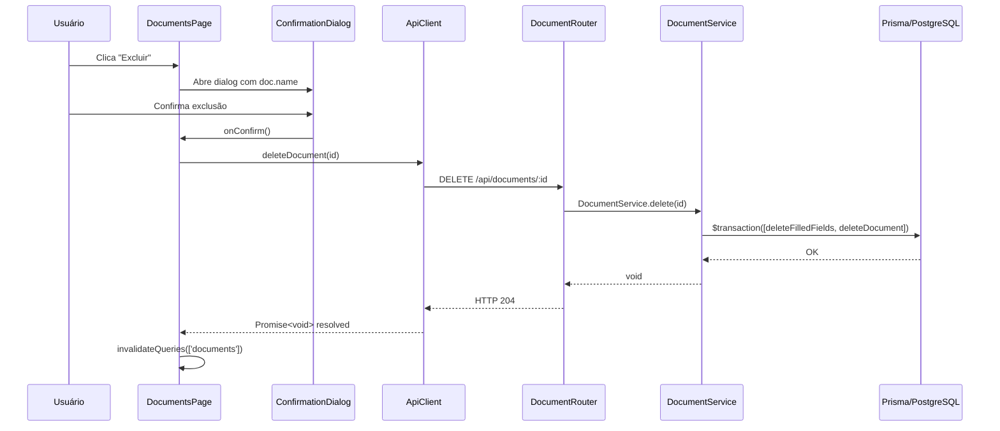

# Design Document — Document Deletion

## Overview

Esta feature adiciona suporte completo à exclusão permanente de documentos na aplicação RegCheck. A implementação segue o padrão já estabelecido no projeto: rota Express com validação Zod, serviço com lógica de negócio, cliente HTTP no frontend e atualização reativa via React Query.

A exclusão é um **hard delete**: o documento e todos os seus `FilledField`s associados são removidos em uma única transação. Não há soft delete ou arquivamento.

O fluxo é:

1. Usuário clica em "Excluir" na `DocumentsPage`
2. Um `ConfirmationDialog` exibe o nome do documento e avisa que a ação é irreversível
3. Ao confirmar, o frontend chama `DELETE /api/documents/:id`
4. O backend remove documento + campos em transação e retorna 204
5. O frontend invalida a query `['documents']`, removendo o item da lista sem reload

---

## Architecture



---

## Components and Interfaces

### Backend

**`DocumentService.delete(id: string): Promise<void>`**

Novo método estático na classe `DocumentService` existente.

```typescript
static async delete(id: string): Promise<void>
```

- Verifica existência do documento; lança `AppError(404, 'Document not found', 'NOT_FOUND')` se ausente
- Remove `FilledField`s e o `Document` em `prisma.$transaction`

**`DocumentRouter` — `DELETE /:id`**

Nova rota adicionada ao `documentRouter` existente em `apps/api/src/routes/documents.ts`.

- Valida `req.params` com `idParamSchema` (UUID) — Zod retorna 400 `VALIDATION_ERROR` automaticamente via `errorHandler`
- Chama `DocumentService.delete(id)`
- Retorna `res.status(204).end()`

### Frontend

**`ApiClient.deleteDocument(id: string): Promise<void>`**

Novo método na classe `ApiClient` em `apps/web/src/lib/api.ts`.

```typescript
deleteDocument(id: string): Promise<void>
```

- Chama `this.request<void>(\`/api/documents/${id}\`, { method: 'DELETE' })`
- O método `request` existente já trata erros HTTP lançando `Error` com a mensagem da API

**`ConfirmationDialog`**

Novo componente em `apps/web/src/components/document/confirmation-dialog.tsx`.

```typescript
interface ConfirmationDialogProps {
  open: boolean;
  documentName: string;
  isPending: boolean;
  onConfirm: () => void;
  onCancel: () => void;
}
```

Renderiza um modal com:

- Nome do documento
- Mensagem de irreversibilidade
- Botão "Confirmar" (desabilitado + spinner quando `isPending`)
- Botão "Cancelar"

**`DocumentsPage` — alterações**

- Adiciona botão "Excluir" em cada linha do documento
- Gerencia estado: `deletingDoc: { id: string; name: string } | null`
- Usa `useMutation` do React Query para chamar `api.deleteDocument`
- Em `onSuccess`: `queryClient.invalidateQueries({ queryKey: ['documents'] })` e fecha dialog
- Em `onError`: exibe mensagem de erro sem fechar o dialog

---

## Data Models

Nenhum modelo novo é necessário. A operação utiliza os modelos existentes:

```
Document
  id          String   @id @default(uuid())
  ...
  filledFields FilledField[]

FilledField
  id          String   @id @default(uuid())
  documentId  String
  document    Document @relation(...)
  ...
```

A deleção em cascata é feita **explicitamente via transação** no serviço (não via `onDelete: Cascade` no schema), mantendo consistência com o padrão já adotado em `populate()` que usa `prisma.filledField.deleteMany`.

**Ordem da transação:**

1. `prisma.filledField.deleteMany({ where: { documentId: id } })`
2. `prisma.document.delete({ where: { id } })`

---

## Correctness Properties

_A property is a characteristic or behavior that should hold true across all valid executions of a system — essentially, a formal statement about what the system should do. Properties serve as the bridge between human-readable specifications and machine-verifiable correctness guarantees._

### Property 1: Exclusão remove documento e todos os FilledFields

_For any_ documento com qualquer número de `FilledField`s associados, após a execução de `DocumentService.delete(id)`, nem o documento nem nenhum de seus `FilledField`s devem existir no banco de dados.

**Validates: Requirements 1.4**

### Property 2: Inputs inválidos são rejeitados com VALIDATION_ERROR

_For any_ string que não seja um UUID v4 válido enviada como parâmetro `:id`, o endpoint `DELETE /api/documents/:id` deve retornar HTTP 400 com `code: 'VALIDATION_ERROR'`.

**Validates: Requirements 1.3**

### Property 3: Erros HTTP do servidor são propagados como Error

_For any_ resposta HTTP de erro (4xx ou 5xx) retornada pelo servidor, `ApiClient.deleteDocument` deve rejeitar a Promise com uma instância de `Error` cuja mensagem corresponde ao campo `error.message` do corpo da resposta.

**Validates: Requirements 2.3**

### Property 4: Botão "Excluir" presente para cada documento listado

_For any_ lista de N documentos renderizada na `DocumentsPage`, exatamente N botões "Excluir" devem estar presentes no DOM.

**Validates: Requirements 3.1**

### Property 5: Dialog exibe o nome do documento correto

_For any_ documento na lista, ao clicar no botão "Excluir" desse documento, o `ConfirmationDialog` deve exibir o nome exato daquele documento.

**Validates: Requirements 3.2**

---

## Error Handling

| Cenário                  | Camada                 | Comportamento                                                |
| ------------------------ | ---------------------- | ------------------------------------------------------------ |
| `id` não é UUID          | `DocumentRouter` (Zod) | HTTP 400, `VALIDATION_ERROR`                                 |
| Documento não encontrado | `DocumentService`      | `AppError(404, NOT_FOUND)` → HTTP 404                        |
| Falha de banco de dados  | `DocumentService`      | Erro propagado → `errorHandler` → HTTP 500, `INTERNAL_ERROR` |
| Erro HTTP no frontend    | `ApiClient`            | Promise rejeitada com `Error(message)`                       |
| Erro na mutation         | `DocumentsPage`        | Mensagem de erro exibida; dialog permanece aberto            |

O `errorHandler` existente já cobre todos os casos de backend sem necessidade de alteração.

---

## Testing Strategy

### Abordagem dual

- **Testes unitários/de exemplo**: cobrem cenários concretos, casos de borda e integrações entre componentes
- **Testes de propriedade**: verificam invariantes universais com entradas geradas aleatoriamente (biblioteca: `fast-check`)

### Backend (Vitest + Prisma mock)

**Testes de exemplo:**

- `DELETE /api/documents/:id` com id válido → 204 sem corpo
- `DELETE /api/documents/:id` com id inexistente → 404 `NOT_FOUND`
- Falha de banco simulada → 500 `INTERNAL_ERROR`

**Testes de propriedade (fast-check):**

- Property 1: Para qualquer documento com N filledFields gerados, após delete, documento e campos não existem
- Property 2: Para qualquer string não-UUID, endpoint retorna 400 `VALIDATION_ERROR`

### Frontend (Vitest + React Testing Library)

**Testes de exemplo:**

- `deleteDocument(id)` faz requisição `DELETE` para URL correta
- Servidor retorna 204 → Promise resolve como void
- Confirmar no dialog chama `api.deleteDocument(id)` com id correto
- Sucesso → `invalidateQueries(['documents'])` chamado, dialog fechado
- Cancelar → `api.deleteDocument` não chamado
- Loading → botão confirmar desabilitado, spinner visível
- Erro → mensagem exibida, dialog permanece aberto

**Testes de propriedade (fast-check):**

- Property 3: Para qualquer resposta de erro HTTP, ApiClient rejeita com Error(message)
- Property 4: Para qualquer lista de N documentos, N botões "Excluir" presentes
- Property 5: Para qualquer documento, dialog exibe o nome correto

**Configuração de testes de propriedade:**

- Mínimo de 100 iterações por propriedade
- Tag de referência: `// Feature: document-deletion, Property {N}: {texto}`
