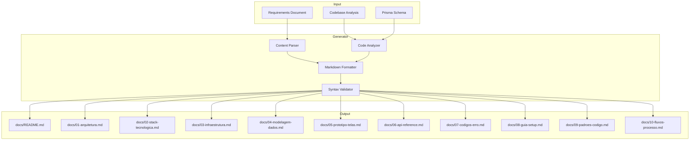
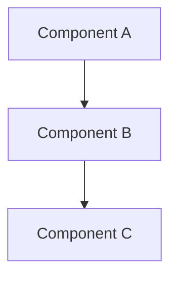
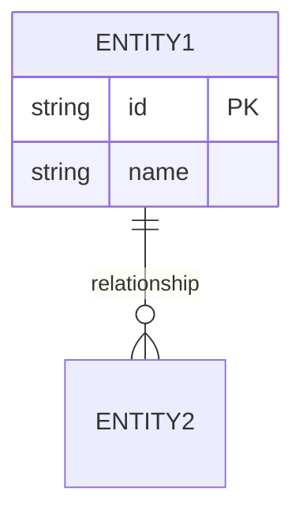
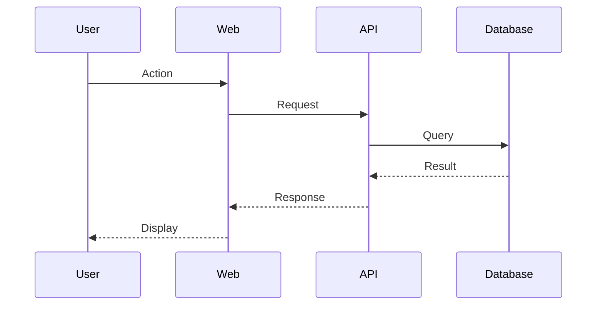
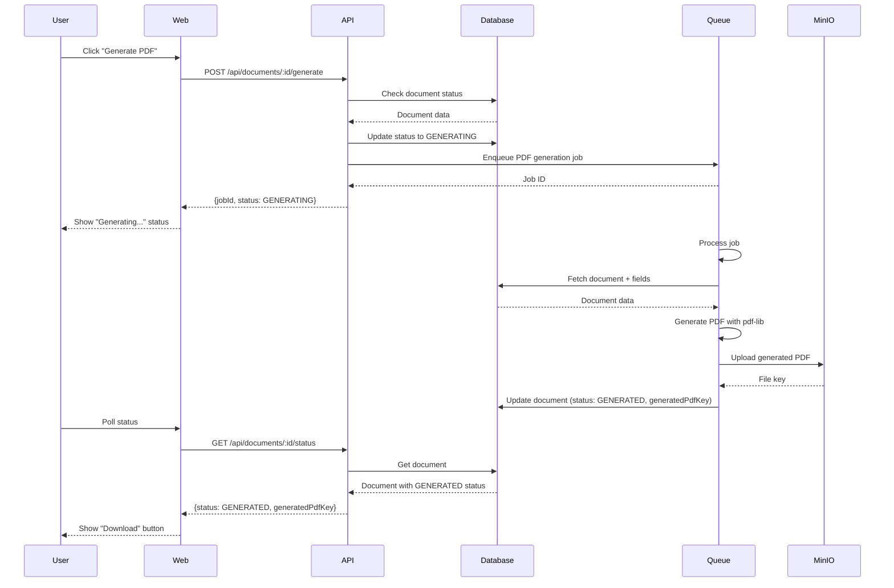

# Design Document: Comprehensive Technical Documentation System

## Overview

This design specifies a documentation generation system for the RegCheck project. The system will create a comprehensive set of technical documentation files covering architecture, technology stack, infrastructure, data modeling, API reference, error codes, setup guides, coding standards, and process flows.

The documentation will be generated as structured Markdown files with Mermaid diagrams, organized in a `docs/` directory at the repository root. Each document follows a consistent format with clear sections, proper cross-references, and visual diagrams where appropriate.

**Key Design Principles:**
- **Completeness**: Cover all aspects of the system from architecture to deployment
- **Consistency**: Use uniform formatting, structure, and terminology across all documents
- **Maintainability**: Structure content to be easily updated as the system evolves
- **Discoverability**: Provide clear navigation through an index and cross-references
- **Visual Clarity**: Use Mermaid diagrams to illustrate complex relationships and flows

## Architecture

### High-Level Architecture

The documentation generation system follows a **static file generation** approach:



### Component Responsibilities

**Content Parser**
- Extracts information from requirements document
- Identifies key entities, relationships, and requirements
- Maps requirements to documentation sections

**Code Analyzer**
- Scans route files to extract API endpoints
- Analyzes service files to understand business logic
- Parses Prisma schema to extract data model
- Identifies error codes from error handler middleware
- Extracts environment variables from .env files

**Markdown Formatter**
- Generates well-structured Markdown content
- Creates Mermaid diagram syntax
- Ensures consistent heading hierarchy
- Formats code blocks with proper language tags
- Creates tables for structured data

**Syntax Validator**
- Validates Markdown syntax
- Validates Mermaid diagram syntax
- Checks internal link references
- Ensures consistent formatting

## Components and Interfaces

### File Structure

```
docs/
├── README.md                    # Index with navigation
├── 01-arquitetura.md           # Architecture specification
├── 02-stack-tecnologica.md     # Technology stack
├── 03-infraestrutura.md        # Infrastructure and environment
├── 04-modelagem-dados.md       # Data modeling and ERD
├── 05-prototipo-telas.md       # UI screens and navigation
├── 06-api-reference.md         # API endpoint documentation
├── 07-codigos-erro.md          # Error codes reference
├── 08-guia-setup.md            # Setup guide
├── 09-padroes-codigo.md        # Code standards
└── 10-fluxos-processo.md       # Process flows
```

### Document Templates

Each documentation file follows a consistent structure:

**Standard Document Structure:**
```markdown
# [Document Title]

## Introdução

[Brief introduction explaining the purpose and scope]

## [Section 1]

[Content with subsections as needed]

### [Subsection 1.1]

[Detailed content]

## [Section 2]

[Content]

## Referências

[Links to related documents]
```

### Mermaid Diagram Standards

**Graph Diagrams (Architecture, Navigation):**


**Entity Relationship Diagrams:**


**Sequence Diagrams (Process Flows):**


## Data Models

### Documentation Content Model

```typescript
interface DocumentationFile {
  filename: string;           // e.g., "01-arquitetura.md"
  title: string;              // e.g., "Arquitetura do Sistema"
  sections: Section[];
  diagrams: Diagram[];
  references: Reference[];
}

interface Section {
  level: number;              // 1-6 (heading level)
  title: string;
  content: string;
  subsections: Section[];
}

interface Diagram {
  type: 'graph' | 'erDiagram' | 'sequenceDiagram';
  title: string;
  mermaidCode: string;
}

interface Reference {
  text: string;
  url: string;
  type: 'internal' | 'external';
}
```

### API Endpoint Model

```typescript
interface ApiEndpoint {
  method: 'GET' | 'POST' | 'PATCH' | 'DELETE';
  path: string;               // e.g., "/api/templates/:id"
  description: string;
  parameters: Parameter[];
  requestBody?: RequestBody;
  responses: Response[];
  example?: Example;
}

interface Parameter {
  name: string;
  location: 'path' | 'query' | 'header';
  type: string;
  required: boolean;
  description: string;
}

interface RequestBody {
  contentType: string;
  schema: object;
  example: object;
}

interface Response {
  statusCode: number;
  description: string;
  schema: object;
  example: object;
}
```

### Error Code Model

```typescript
interface ErrorCode {
  code: string;               // e.g., "NOT_FOUND"
  httpStatus: number;         // e.g., 404
  message: string;
  context: string;            // When this error occurs
  example: object;            // Example error response
}
```

## Error Handling

### Validation Errors

**Invalid Markdown Syntax:**
- **Detection**: Markdown parser fails to parse generated content
- **Handling**: Log syntax error with line number, regenerate section
- **Recovery**: Use fallback plain text format if parsing continues to fail

**Invalid Mermaid Syntax:**
- **Detection**: Mermaid diagram contains syntax errors
- **Handling**: Log diagram error, validate against Mermaid grammar
- **Recovery**: Simplify diagram or use alternative representation

**Missing Required Content:**
- **Detection**: Required section is empty or missing
- **Handling**: Log warning with missing section name
- **Recovery**: Generate placeholder content with TODO marker

### File System Errors

**Directory Creation Failure:**
- **Detection**: Cannot create `docs/` directory
- **Handling**: Check permissions, log error
- **Recovery**: Attempt to use alternative location or fail gracefully

**File Write Failure:**
- **Detection**: Cannot write documentation file
- **Handling**: Check disk space and permissions
- **Recovery**: Retry with exponential backoff, then fail

### Content Extraction Errors

**Missing Source Files:**
- **Detection**: Required source file (route, schema) not found
- **Handling**: Log warning with missing file path
- **Recovery**: Generate documentation with "não identificado" marker

**Parse Errors:**
- **Detection**: Cannot parse TypeScript/Prisma source
- **Handling**: Log parse error with file and line number
- **Recovery**: Skip problematic section, mark as incomplete

## Testing Strategy

This feature involves **file generation, content structure validation, and markdown formatting** — areas where property-based testing is not appropriate. The testing strategy will focus on:

### Unit Tests

**Markdown Formatter Tests:**
- Test heading generation with correct levels (1-6)
- Test code block formatting with language tags
- Test table generation with proper alignment
- Test list formatting (ordered and unordered)
- Test link formatting (internal and external)

**Mermaid Generator Tests:**
- Test graph diagram generation with nodes and edges
- Test ERD generation with entities and relationships
- Test sequence diagram generation with participants and messages
- Test diagram syntax validation

**Content Extractor Tests:**
- Test API endpoint extraction from route files
- Test entity extraction from Prisma schema
- Test error code extraction from error handlers
- Test environment variable extraction from .env files

**Example Test Cases:**
```typescript
describe('Markdown Formatter', () => {
  it('should generate heading with correct level', () => {
    const result = formatHeading('Title', 2);
    expect(result).toBe('## Title\n\n');
  });

  it('should generate code block with language tag', () => {
    const result = formatCodeBlock('const x = 1;', 'typescript');
    expect(result).toBe('```typescript\nconst x = 1;\n```\n\n');
  });

  it('should generate table with headers and rows', () => {
    const headers = ['Name', 'Type'];
    const rows = [['id', 'string'], ['name', 'string']];
    const result = formatTable(headers, rows);
    expect(result).toContain('| Name | Type |');
    expect(result).toContain('| id | string |');
  });
});
```

### Integration Tests

**End-to-End Documentation Generation:**
- Generate complete documentation set from test codebase
- Verify all expected files are created
- Verify file content matches expected structure
- Verify all Mermaid diagrams are syntactically valid
- Verify all internal links resolve correctly

**File System Integration:**
- Test directory creation
- Test file writing with various content sizes
- Test file overwriting behavior
- Test handling of existing files

### Validation Tests

**Markdown Syntax Validation:**
- Parse generated markdown with markdown parser
- Verify no syntax errors
- Verify heading hierarchy is correct
- Verify all code blocks are properly closed

**Mermaid Syntax Validation:**
- Validate each diagram against Mermaid grammar
- Test diagram rendering (if Mermaid CLI available)
- Verify diagram types are correct

**Content Completeness:**
- Verify all required sections are present
- Verify no placeholder content in production
- Verify all cross-references are valid

### Snapshot Tests

**Documentation Structure:**
- Capture snapshot of generated file structure
- Capture snapshot of index file content
- Detect unintended changes to documentation format

**Diagram Output:**
- Capture snapshot of Mermaid diagram syntax
- Detect changes to diagram structure

## Implementation Details

### Document Generation Order

1. **Create docs/ directory** if it doesn't exist
2. **Generate 04-modelagem-dados.md** (data model from Prisma schema)
3. **Generate 06-api-reference.md** (API endpoints from routes)
4. **Generate 07-codigos-erro.md** (error codes from error handler)
5. **Generate 01-arquitetura.md** (architecture overview)
6. **Generate 02-stack-tecnologica.md** (technology stack)
7. **Generate 03-infraestrutura.md** (infrastructure setup)
8. **Generate 05-prototipo-telas.md** (UI screens)
9. **Generate 08-guia-setup.md** (setup guide)
10. **Generate 09-padroes-codigo.md** (code standards)
11. **Generate 10-fluxos-processo.md** (process flows)
12. **Generate README.md** (index with links to all documents)

### Content Extraction Strategies

**API Endpoints Extraction:**
```typescript
// Parse route files to extract endpoints
function extractEndpoints(routeFile: string): ApiEndpoint[] {
  const ast = parseTypeScript(routeFile);
  const endpoints: ApiEndpoint[] = [];
  
  // Find router method calls (get, post, patch, delete)
  ast.statements.forEach(statement => {
    if (isRouterMethodCall(statement)) {
      const endpoint = {
        method: statement.method.toUpperCase(),
        path: statement.arguments[0].value,
        description: extractComment(statement),
        // ... extract parameters, body, responses
      };
      endpoints.push(endpoint);
    }
  });
  
  return endpoints;
}
```

**Prisma Schema Extraction:**
```typescript
// Parse Prisma schema to extract entities
function extractEntities(schemaFile: string): Entity[] {
  const lines = schemaFile.split('\n');
  const entities: Entity[] = [];
  let currentEntity: Entity | null = null;
  
  lines.forEach(line => {
    if (line.startsWith('model ')) {
      currentEntity = {
        name: line.split(' ')[1],
        fields: [],
        relations: []
      };
      entities.push(currentEntity);
    } else if (currentEntity && line.trim()) {
      // Parse field definition
      const field = parseField(line);
      if (field) currentEntity.fields.push(field);
    }
  });
  
  return entities;
}
```

**Error Codes Extraction:**
```typescript
// Extract error codes from error responses in routes
function extractErrorCodes(routeFiles: string[]): ErrorCode[] {
  const errorCodes: ErrorCode[] = [];
  
  routeFiles.forEach(file => {
    const content = readFile(file);
    // Find error response patterns
    const errorPattern = /error:\s*{\s*code:\s*['"](\w+)['"]/g;
    let match;
    
    while ((match = errorPattern.exec(content)) !== null) {
      const code = match[1];
      if (!errorCodes.find(e => e.code === code)) {
        errorCodes.push({
          code,
          httpStatus: extractHttpStatus(content, match.index),
          message: extractErrorMessage(content, match.index),
          context: extractContext(content, match.index)
        });
      }
    }
  });
  
  return errorCodes;
}
```

### Markdown Generation Utilities

**Heading Generator:**
```typescript
function heading(text: string, level: number): string {
  return '#'.repeat(level) + ' ' + text + '\n\n';
}
```

**Table Generator:**
```typescript
function table(headers: string[], rows: string[][]): string {
  const headerRow = '| ' + headers.join(' | ') + ' |';
  const separator = '|' + headers.map(() => '---').join('|') + '|';
  const dataRows = rows.map(row => '| ' + row.join(' | ') + ' |');
  
  return [headerRow, separator, ...dataRows].join('\n') + '\n\n';
}
```

**Code Block Generator:**
```typescript
function codeBlock(code: string, language: string): string {
  return '```' + language + '\n' + code + '\n```\n\n';
}
```

**Mermaid Diagram Generator:**
```typescript
function mermaidDiagram(type: string, content: string): string {
  return '```mermaid\n' + type + '\n' + content + '\n```\n\n';
}
```

### Specific Document Content

#### 01-arquitetura.md

**Structure:**
- Introdução (overview of RegCheck system)
- Tipo de Arquitetura (monorepo modular)
- Camadas Arquiteturais (apps, packages, infrastructure)
- Diagrama: Monorepo Structure (graph showing apps and packages)
- Diagrama: Technology Stack by Layer (graph showing tech by layer)
- Fluxo Geral da Aplicação (upload → template → document → PDF)
- Responsabilidades dos Componentes

**Key Diagrams:**
```mermaid
graph TB
    subgraph Apps
        API[apps/api<br/>Express :4000]
        WEB[apps/web<br/>Next.js :3000]
    end
    
    subgraph Packages
        DB[@regcheck/database<br/>Prisma]
        PDF[@regcheck/pdf-engine]
        EDITOR[@regcheck/editor-engine]
        SHARED[@regcheck/shared]
        VALIDATORS[@regcheck/validators]
        UI[@regcheck/ui]
    end
    
    subgraph Infrastructure
        PG[PostgreSQL 16]
        REDIS[Redis 7]
        MINIO[MinIO S3]
    end
    
    API --> DB
    API --> PDF
    API --> SHARED
    API --> VALIDATORS
    WEB --> EDITOR
    WEB --> SHARED
    WEB --> UI
    API --> PG
    API --> REDIS
    API --> MINIO
```

#### 04-modelagem-dados.md

**Structure:**
- Introdução (overview of data model)
- Entidades Principais (list all entities with descriptions)
- Diagrama ER (complete ERD with all relationships)
- Detalhamento das Entidades (each entity with fields and types)
- Enumerações (TemplateStatus, DocumentStatus, FieldType)
- Relacionamentos (explain each relationship)

**ERD Generation:**
```typescript
function generateERD(entities: Entity[]): string {
  let mermaid = 'erDiagram\n';
  
  // Add relationships
  entities.forEach(entity => {
    entity.relations.forEach(rel => {
      mermaid += `    ${entity.name} ${rel.cardinality} ${rel.target} : ${rel.name}\n`;
    });
  });
  
  // Add entity definitions
  entities.forEach(entity => {
    mermaid += `    ${entity.name} {\n`;
    entity.fields.forEach(field => {
      mermaid += `        ${field.type} ${field.name}${field.isPrimaryKey ? ' PK' : ''}\n`;
    });
    mermaid += `    }\n`;
  });
  
  return mermaid;
}
```

#### 06-api-reference.md

**Structure:**
- Introdução (API overview)
- Formato de Resposta (ApiResponse structure)
- Autenticação (mark as "não identificado")
- Endpoints por Recurso:
  - Templates
  - Documents
  - Uploads
  - Equipamentos
  - Lojas
  - Setores
  - Tipos de Equipamento

**Endpoint Documentation Format:**
```markdown
### POST /api/templates

Cria um novo template a partir de um PDF já enviado.

**Parâmetros:**
Nenhum

**Corpo da Requisição:**
```json
{
  "name": "Template de Etiquetas",
  "description": "Template para etiquetas de equipamentos",
  "pdfFileKey": "pdfs/abc123.pdf"
}
```

**Resposta de Sucesso (201):**
```json
{
  "success": true,
  "data": {
    "id": "uuid",
    "name": "Template de Etiquetas",
    "status": "DRAFT",
    "version": 1,
    "pdfFileId": "uuid",
    "createdAt": "2024-01-01T00:00:00.000Z"
  }
}
```

**Erros Possíveis:**
- 400 PDF_NOT_FOUND: PDF file not found
- 400 VALIDATION_ERROR: Invalid input data
```

#### 10-fluxos-processo.md

**Structure:**
- Introdução (overview of business processes)
- Fluxo 1: Upload de PDF e Criação de Template
- Fluxo 2: Edição de Template
- Fluxo 3: Publicação de Template
- Fluxo 4: Criação de Documento
- Fluxo 5: População de Documento com Equipamentos
- Fluxo 6: Preenchimento de Documento
- Fluxo 7: Geração de PDF

**Sequence Diagram Example:**


### Validation and Quality Checks

**Pre-Generation Validation:**
- Verify all source files exist (routes, schema, services)
- Verify docs/ directory is writable
- Verify no conflicting files exist (or confirm overwrite)

**Post-Generation Validation:**
- Parse each generated markdown file
- Validate all Mermaid diagrams
- Check all internal links resolve
- Verify no placeholder content remains
- Verify file sizes are reasonable (not empty, not too large)

**Quality Metrics:**
- All 11 documentation files generated
- All required sections present in each file
- All Mermaid diagrams syntactically valid
- All internal links valid
- No "TODO" or "não identificado" markers (except where explicitly required)

## Deployment Considerations

This is a **development-time tool** for generating documentation, not a runtime service. Deployment considerations:

**Local Development:**
- Run as a script: `pnpm generate:docs`
- Output to `docs/` directory in repository root
- Commit generated documentation to version control

**CI/CD Integration:**
- Run documentation generation in CI pipeline
- Fail build if documentation is out of sync with code
- Auto-commit updated documentation (optional)

**Documentation Hosting:**
- Serve from GitHub Pages (if public repository)
- Serve from internal documentation portal
- Include in project README with links

**Maintenance:**
- Re-generate documentation when code changes
- Review generated content for accuracy
- Update templates as documentation needs evolve

## Future Enhancements

**Interactive Documentation:**
- Generate OpenAPI/Swagger spec from routes
- Add interactive API playground
- Generate TypeScript SDK from API spec

**Automated Updates:**
- Git hooks to regenerate docs on commit
- CI checks to ensure docs are up-to-date
- Automated PR creation when docs change

**Enhanced Diagrams:**
- Generate architecture diagrams from code dependencies
- Generate component interaction diagrams
- Generate database query flow diagrams

**Multi-Language Support:**
- Generate documentation in multiple languages
- Support i18n for technical terms
- Maintain language-specific glossaries

**Documentation Testing:**
- Test code examples in documentation
- Validate API examples against actual API
- Check for broken external links

## References

- [Mermaid Documentation](https://mermaid.js.org/)
- [Markdown Specification](https://spec.commonmark.org/)
- [Prisma Schema Reference](https://www.prisma.io/docs/reference/api-reference/prisma-schema-reference)
- [Express Routing Guide](https://expressjs.com/en/guide/routing.html)
