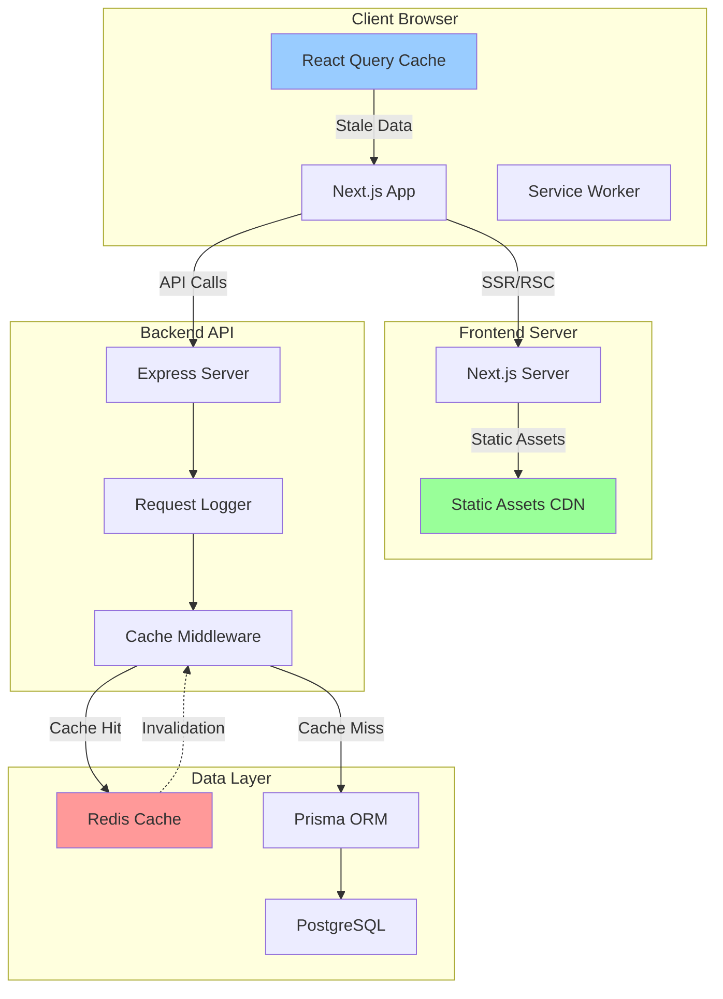

# Design Document: Page Load Optimization

## Overview

This design addresses comprehensive performance optimization for the RegCheck application, targeting sub-second page load times across all routes. The system currently experiences slow page loads due to inefficient database queries, large JavaScript bundles, lack of caching, and suboptimal data fetching patterns.

The optimization strategy spans both the Next.js frontend (apps/web) and Express backend (apps/api), implementing industry-standard performance patterns including:

- **Backend**: Redis caching layer, query optimization with Prisma, response time monitoring
- **Frontend**: Code splitting, lazy loading, React Query optimization, image optimization
- **Infrastructure**: Database indexing, bundle analysis, Web Vitals tracking

### Key Performance Targets

- API response time: < 200ms for listings, < 150ms for detail views
- First Load JS: < 150KB (gzipped)
- Database query execution: < 50ms
- Time to Interactive (TTI): < 2 seconds
- Largest Contentful Paint (LCP): < 2.5 seconds

### Technology Stack Context

**Backend (apps/api)**:

- Express.js with TypeScript
- Prisma ORM with PostgreSQL
- Redis (already available via ioredis)
- BullMQ for background jobs
- AWS S3 for file storage

**Frontend (apps/web)**:

- Next.js 14 (App Router)
- React 18 with Server Components
- TanStack React Query v5
- Tailwind CSS
- Heavy libraries: pdfjs-dist, konva, tesseract.js

## Architecture

### System Architecture Overview



### Caching Strategy

The system implements a multi-layer caching approach:

1. **Browser Cache**: Static assets with long-term cache headers
2. **React Query Cache**: Client-side data cache with configurable stale times
3. **Redis Cache**: Server-side cache for frequently accessed data
4. **Database Query Cache**: Prisma query result caching

### Data Flow Optimization

**Before Optimization**:

```
User Request → Next.js → API → Prisma → PostgreSQL (N+1 queries) → Response (500ms+)
```

**After Optimization**:

```
User Request → Next.js (SSR with prefetch) → API → Redis (cache hit) → Response (50ms)
                                                  ↓ (cache miss)
                                              Prisma (optimized query) → PostgreSQL → Response (150ms)
```

## Components and Interfaces

### Backend Components

#### 1. Cache Service (`apps/api/src/lib/cache.ts`)

Centralized Redis caching service with automatic invalidation.

```typescript
interface CacheService {
  get<T>(key: string): Promise<T | null>;
  set<T>(key: string, value: T, ttl?: number): Promise<void>;
  del(key: string): Promise<void>;
  delPattern(pattern: string): Promise<void>;
  wrap<T>(key: string, fn: () => Promise<T>, ttl?: number): Promise<T>;
}
```

**Key Features**:

- Generic type support for type-safe caching
- Pattern-based invalidation for related keys
- Wrap function for cache-aside pattern
- Graceful degradation when Redis is unavailable

#### 2. Cache Middleware (`apps/api/src/middleware/cache-middleware.ts`)

Express middleware for automatic response caching.

```typescript
interface CacheMiddlewareOptions {
  ttl: number;
  keyGenerator?: (req: Request) => string;
  shouldCache?: (req: Request, res: Response) => boolean;
}

function cacheMiddleware(options: CacheMiddlewareOptions): RequestHandler;
```

#### 3. Query Optimization Service

Prisma query builder with automatic includes and selects.

```typescript
interface QueryOptions {
  page?: number;
  pageSize?: number;
  include?: Record<string, boolean>;
  select?: Record<string, boolean>;
  orderBy?: Record<string, 'asc' | 'desc'>;
}
```

#### 4. Performance Monitoring Service (`apps/api/src/lib/performance.ts`)

Tracks and logs slow queries and requests.

```typescript
interface PerformanceMetrics {
  requestId: string;
  method: string;
  path: string;
  duration: number;
  queryCount: number;
  slowQueries: Array<{ query: string; duration: number }>;
}
```

### Frontend Components

#### 1. Query Configuration (`apps/web/src/lib/query-config.ts`)

Centralized React Query configuration with optimized defaults.

```typescript
interface QueryConfig {
  defaultOptions: {
    queries: {
      staleTime: number;
      cacheTime: number;
      refetchOnWindowFocus: boolean;
      retry: number;
    };
  };
}
```

#### 2. Prefetch Utilities (`apps/web/src/lib/prefetch.ts`)

Helper functions for prefetching data on hover/focus.

```typescript
interface PrefetchOptions {
  queryKey: QueryKey;
  queryFn: QueryFunction;
  staleTime?: number;
}

function usePrefetch(options: PrefetchOptions): {
  onMouseEnter: () => void;
  onFocus: () => void;
};
```

#### 3. Performance Monitor (`apps/web/src/lib/performance-monitor.ts`)

Web Vitals tracking and reporting.

```typescript
interface WebVitalsMetrics {
  LCP: number; // Largest Contentful Paint
  FID: number; // First Input Delay
  CLS: number; // Cumulative Layout Shift
  TTFB: number; // Time to First Byte
  FCP: number; // First Contentful Paint
}

function reportWebVitals(metric: WebVitalsMetrics): void;
```

#### 4. Dynamic Import Wrappers

Lazy-loaded component wrappers for heavy dependencies.

```typescript
// PDF Viewer - lazy loaded
const PDFViewer = dynamic(() => import('@/components/pdf-viewer'), {
  loading: () => <PDFViewerSkeleton />,
  ssr: false
});

// Konva Editor - lazy loaded
const TemplateEditor = dynamic(() => import('@/components/template-editor'), {
  loading: () => <EditorSkeleton />,
  ssr: false
});
```

### API Endpoints Optimization

All endpoints will be optimized with the following patterns:

#### Listing Endpoints

```typescript
GET /api/lojas?page=1&pageSize=50
GET /api/setores?page=1&pageSize=50
GET /api/tipos-equipamento?page=1&pageSize=50
GET /api/equipamentos?page=1&pageSize=50
GET /api/documents?page=1&pageSize=50
GET /api/templates?page=1&pageSize=50
```

**Optimizations**:

- Redis caching with 5-minute TTL
- Prisma select for specific fields only
- Eager loading of required relations
- Maximum pageSize of 100

#### Detail Endpoints

```typescript
GET /api/lojas/:id
GET /api/equipamentos/:id
GET /api/documents/:id
GET /api/templates/:id
```

**Optimizations**:

- Redis caching with 2-minute TTL
- Conditional includes based on query params
- Cache invalidation on updates

## Data Models

### Cache Key Patterns

Consistent cache key naming for easy invalidation:

```typescript
// Listing caches
const CACHE_KEYS = {
  LOJAS_LIST: 'lojas:list:page:{page}:size:{pageSize}',
  SETORES_LIST: 'setores:list:page:{page}:size:{pageSize}',
  TIPOS_LIST: 'tipos:list:page:{page}:size:{pageSize}',
  EQUIPAMENTOS_LIST: 'equipamentos:list:page:{page}:size:{pageSize}',
  DOCUMENTS_LIST: 'documents:list:page:{page}:size:{pageSize}',
  TEMPLATES_LIST: 'templates:list:page:{page}:size:{pageSize}',

  // Detail caches
  LOJA_DETAIL: 'loja:{id}',
  SETOR_DETAIL: 'setor:{id}',
  TIPO_DETAIL: 'tipo:{id}',
  EQUIPAMENTO_DETAIL: 'equipamento:{id}',
  DOCUMENT_DETAIL: 'document:{id}',
  TEMPLATE_DETAIL: 'template:{id}',
};
```

### Cache Invalidation Rules

```typescript
// When a loja is created/updated/deleted
invalidate('lojas:list:*', 'loja:{id}');

// When an equipamento is created/updated/deleted
invalidate('equipamentos:list:*', 'equipamento:{id}');

// When a document is updated
invalidate('documents:list:*', 'document:{id}');

// When a template is published
invalidate('templates:list:*', 'template:{id}');
```

### Database Indexes

Required indexes for optimal query performance:

```sql
-- Equipamentos table
CREATE INDEX idx_equipamentos_tipo_loja ON "Equipamento"("tipoId", "lojaId");
CREATE INDEX idx_equipamentos_setor ON "Equipamento"("setorId");
CREATE INDEX idx_equipamentos_numero ON "Equipamento"("numeroEquipamento");

-- Documents table
CREATE INDEX idx_documents_template ON "Document"("templateId");
CREATE INDEX idx_documents_status ON "Document"("status");
CREATE INDEX idx_documents_created ON "Document"("createdAt" DESC);

-- Templates table
CREATE INDEX idx_templates_status ON "Template"("status");
CREATE INDEX idx_templates_created ON "Template"("createdAt" DESC);

-- FilledFields table (already has composite unique index)
-- Existing: idx_filledfields_document_field_item

-- Fields table
CREATE INDEX idx_fields_template ON "Field"("templateId");
```

### Performance Metrics Schema

```typescript
interface RequestMetrics {
  timestamp: Date;
  method: string;
  path: string;
  statusCode: number;
  duration: number;
  cacheHit: boolean;
  queryCount: number;
  slowQueries: Array<{
    query: string;
    duration: number;
    params: unknown;
  }>;
}

interface PageLoadMetrics {
  timestamp: Date;
  route: string;
  ttfb: number;
  fcp: number;
  lcp: number;
  fid: number;
  cls: number;
  totalLoadTime: number;
  bundleSize: number;
}
```

## Error Handling

### Cache Failure Handling

The system must gracefully degrade when Redis is unavailable:

```typescript
class CacheService {
  async get<T>(key: string): Promise<T | null> {
    try {
      const value = await this.redis.get(key);
      return value ? JSON.parse(value) : null;
    } catch (error) {
      console.error('[Cache] Get failed:', error);
      // Graceful degradation - return null to trigger database query
      return null;
    }
  }

  async set<T>(key: string, value: T, ttl?: number): Promise<void> {
    try {
      await this.redis.set(key, JSON.stringify(value), 'EX', ttl ?? 300);
    } catch (error) {
      console.error('[Cache] Set failed:', error);
      // Don't throw - cache failures shouldn't break the application
    }
  }
}
```

**Error Scenarios**:

1. **Redis Connection Lost**: Continue serving from database, log errors
2. **Cache Serialization Error**: Skip caching, serve from database
3. **Cache Invalidation Failure**: Log error, continue operation
4. **TTL Configuration Error**: Use default TTL (5 minutes)

### Database Query Timeout

Implement query timeouts to prevent hanging requests:

```typescript
// Prisma client configuration
const prisma = new PrismaClient({
  datasources: {
    db: {
      url: process.env.DATABASE_URL,
    },
  },
  log: [
    { level: 'query', emit: 'event' },
    { level: 'error', emit: 'stdout' },
    { level: 'warn', emit: 'stdout' },
  ],
});

// Query timeout middleware
prisma.$use(async (params, next) => {
  const timeout = 5000; // 5 seconds
  const timeoutPromise = new Promise((_, reject) => {
    setTimeout(() => reject(new Error('Query timeout')), timeout);
  });

  try {
    return await Promise.race([next(params), timeoutPromise]);
  } catch (error) {
    if (error.message === 'Query timeout') {
      console.error('[DB] Query timeout:', params);
      throw new AppError(504, 'Database query timeout', 'QUERY_TIMEOUT');
    }
    throw error;
  }
});
```

### Bundle Loading Errors

Handle dynamic import failures gracefully:

```typescript
const PDFViewer = dynamic(() => import('@/components/pdf-viewer'), {
  loading: () => <PDFViewerSkeleton />,
  ssr: false,
}).catch((error) => {
  console.error('[Bundle] Failed to load PDF viewer:', error);
  return () => <ErrorFallback message="Failed to load PDF viewer" />;
});
```

### Performance Monitoring Errors

Ensure monitoring failures don't impact user experience:

```typescript
function reportWebVitals(metric: WebVitalsMetrics): void {
  try {
    // Log to console in development
    if (process.env.NODE_ENV === 'development') {
      console.log('[Web Vitals]', metric);
    }

    // Send to analytics in production
    if (process.env.NODE_ENV === 'production') {
      // Non-blocking analytics call
      fetch('/api/analytics', {
        method: 'POST',
        body: JSON.stringify(metric),
        keepalive: true,
      }).catch((error) => {
        // Silent failure - don't impact user experience
        console.error('[Analytics] Failed to report metrics:', error);
      });
    }
  } catch (error) {
    // Silent failure
    console.error('[Web Vitals] Reporting error:', error);
  }
}
```

### API Response Errors

Maintain consistent error responses even under load:

```typescript
// Error handler with performance context
app.use((err: Error, req: Request, res: Response, next: NextFunction) => {
  const duration = Date.now() - req.startTime;

  console.error('[Error]', {
    path: req.path,
    method: req.method,
    duration,
    error: err.message,
    stack: err.stack,
  });

  if (err instanceof AppError) {
    return res.status(err.statusCode).json({
      error: err.message,
      code: err.code,
      duration,
    });
  }

  // Generic error response
  res.status(500).json({
    error: 'Internal server error',
    code: 'INTERNAL_ERROR',
    duration,
  });
});
```

## Testing Strategy

### Performance Testing Approach

This feature requires a different testing approach than typical functional features. The focus is on:

1. **Performance Benchmarks**: Measure actual response times and load times
2. **Integration Tests**: Verify caching behavior and query optimization
3. **Load Tests**: Ensure performance under concurrent load
4. **Bundle Analysis**: Verify bundle size targets are met

**Why Property-Based Testing Does NOT Apply**:

Property-based testing is designed for testing universal properties of pure functions across many generated inputs. This feature involves:

- Infrastructure configuration (Redis, database indexes)
- Performance characteristics (response times, bundle sizes)
- Side effects (caching, logging, monitoring)
- Integration between systems

None of these have meaningful "for all inputs X, property P(X) holds" statements. Instead, we use:

- **Snapshot tests** for bundle size verification
- **Integration tests** for cache behavior
- **Performance benchmarks** for response time validation
- **Load tests** for scalability verification

### Unit Tests

Focus on individual component behavior:

#### Cache Service Tests

```typescript
describe('CacheService', () => {
  it('should return null when key does not exist', async () => {
    const value = await cacheService.get('nonexistent');
    expect(value).toBeNull();
  });

  it('should store and retrieve values', async () => {
    await cacheService.set('test', { data: 'value' });
    const value = await cacheService.get('test');
    expect(value).toEqual({ data: 'value' });
  });

  it('should handle Redis unavailability gracefully', async () => {
    // Mock Redis failure
    redis.get.mockRejectedValue(new Error('Connection lost'));

    const value = await cacheService.get('test');
    expect(value).toBeNull(); // Graceful degradation
  });

  it('should invalidate pattern-matched keys', async () => {
    await cacheService.set('lojas:list:page:1', []);
    await cacheService.set('lojas:list:page:2', []);
    await cacheService.delPattern('lojas:list:*');

    const page1 = await cacheService.get('lojas:list:page:1');
    const page2 = await cacheService.get('lojas:list:page:2');
    expect(page1).toBeNull();
    expect(page2).toBeNull();
  });
});
```

#### Query Optimization Tests

```typescript
describe('Query Optimization', () => {
  it('should use select to limit returned fields', async () => {
    const lojas = await LojaService.list(1, 10);

    // Verify only necessary fields are returned
    expect(lojas.items[0]).toHaveProperty('id');
    expect(lojas.items[0]).toHaveProperty('nome');
    expect(lojas.items[0]).not.toHaveProperty('createdAt');
  });

  it('should use eager loading for relations', async () => {
    const spy = jest.spyOn(prisma, '$queryRaw');

    await EquipamentoService.list(1, 10);

    // Should be 1 query with JOIN, not N+1 queries
    expect(spy).toHaveBeenCalledTimes(1);
  });
});
```

### Integration Tests

Test caching behavior with real Redis:

```typescript
describe('Cache Integration', () => {
  beforeEach(async () => {
    await redis.flushall();
  });

  it('should cache listing responses', async () => {
    const response1 = await request(app).get('/api/lojas?page=1&pageSize=10');
    const response2 = await request(app).get('/api/lojas?page=1&pageSize=10');

    expect(response1.body).toEqual(response2.body);
    expect(response2.headers['x-cache']).toBe('HIT');
  });

  it('should invalidate cache on create', async () => {
    // Prime cache
    await request(app).get('/api/lojas?page=1&pageSize=10');

    // Create new loja
    await request(app).post('/api/lojas').send({ nome: 'Nova Loja', endereco: 'Rua X' });

    // Cache should be invalidated
    const response = await request(app).get('/api/lojas?page=1&pageSize=10');
    expect(response.headers['x-cache']).toBe('MISS');
  });

  it('should continue working when Redis is down', async () => {
    // Stop Redis
    await redis.disconnect();

    // Should still work, just slower
    const response = await request(app).get('/api/lojas?page=1&pageSize=10');
    expect(response.status).toBe(200);
    expect(response.body.items).toBeDefined();
  });
});
```

### Performance Benchmarks

Measure actual performance against targets:

```typescript
describe('Performance Benchmarks', () => {
  it('should respond to listing requests in < 200ms', async () => {
    const start = Date.now();
    const response = await request(app).get('/api/lojas?page=1&pageSize=50');
    const duration = Date.now() - start;

    expect(response.status).toBe(200);
    expect(duration).toBeLessThan(200);
  });

  it('should respond to detail requests in < 150ms', async () => {
    const loja = await createTestLoja();

    const start = Date.now();
    const response = await request(app).get(`/api/lojas/${loja.id}`);
    const duration = Date.now() - start;

    expect(response.status).toBe(200);
    expect(duration).toBeLessThan(150);
  });

  it('should execute database queries in < 50ms', async () => {
    const queryTimes: number[] = [];

    prisma.$on('query', (e) => {
      queryTimes.push(e.duration);
    });

    await LojaService.list(1, 50);

    const maxQueryTime = Math.max(...queryTimes);
    expect(maxQueryTime).toBeLessThan(50);
  });
});
```

### Bundle Size Tests

Verify bundle size targets:

```typescript
describe('Bundle Size', () => {
  it('should have First Load JS < 150KB', async () => {
    // Run next build and analyze
    const buildInfo = await analyzeBuild();

    const firstLoadJS = buildInfo.pages['/'].firstLoadJS;
    expect(firstLoadJS).toBeLessThan(150 * 1024); // 150KB
  });

  it('should code-split heavy libraries', async () => {
    const buildInfo = await analyzeBuild();

    // PDF.js should be in separate chunk
    const pdfChunk = buildInfo.chunks.find((c) => c.name.includes('pdfjs'));
    expect(pdfChunk).toBeDefined();
    expect(pdfChunk.async).toBe(true);

    // Konva should be in separate chunk
    const konvaChunk = buildInfo.chunks.find((c) => c.name.includes('konva'));
    expect(konvaChunk).toBeDefined();
    expect(konvaChunk.async).toBe(true);
  });
});
```

### Load Testing

Test performance under concurrent load (using k6 or similar):

```javascript
// load-test.js
import http from 'k6/http';
import { check, sleep } from 'k6';

export const options = {
  stages: [
    { duration: '30s', target: 20 }, // Ramp up to 20 users
    { duration: '1m', target: 20 }, // Stay at 20 users
    { duration: '30s', target: 50 }, // Ramp up to 50 users
    { duration: '1m', target: 50 }, // Stay at 50 users
    { duration: '30s', target: 0 }, // Ramp down
  ],
  thresholds: {
    http_req_duration: ['p(95)<200'], // 95% of requests < 200ms
    http_req_failed: ['rate<0.01'], // Error rate < 1%
  },
};

export default function () {
  const response = http.get('http://localhost:4000/api/lojas?page=1&pageSize=50');

  check(response, {
    'status is 200': (r) => r.status === 200,
    'response time < 200ms': (r) => r.timings.duration < 200,
  });

  sleep(1);
}
```

### Frontend Performance Tests

Test Web Vitals in real browser environment (using Playwright):

```typescript
describe('Web Vitals', () => {
  it('should have LCP < 2.5s', async () => {
    const page = await browser.newPage();

    const metrics = await page.evaluate(() => {
      return new Promise((resolve) => {
        new PerformanceObserver((list) => {
          const entries = list.getEntries();
          const lcp = entries[entries.length - 1];
          resolve(lcp.renderTime || lcp.loadTime);
        }).observe({ type: 'largest-contentful-paint', buffered: true });
      });
    });

    expect(metrics).toBeLessThan(2500);
  });

  it('should have FID < 100ms', async () => {
    const page = await browser.newPage();
    await page.goto('http://localhost:3000/cadastros/lojas');

    const fid = await page.evaluate(() => {
      return new Promise((resolve) => {
        new PerformanceObserver((list) => {
          const entry = list.getEntries()[0];
          resolve(entry.processingStart - entry.startTime);
        }).observe({ type: 'first-input', buffered: true });
      });
    });

    expect(fid).toBeLessThan(100);
  });
});
```

### Monitoring and Alerting Tests

Verify monitoring systems are working:

```typescript
describe('Performance Monitoring', () => {
  it('should log slow queries', async () => {
    const logSpy = jest.spyOn(console, 'warn');

    // Simulate slow query
    await prisma.$queryRaw`SELECT pg_sleep(0.15)`;

    expect(logSpy).toHaveBeenCalledWith(expect.stringContaining('[Slow Query]'));
  });

  it('should track request duration', async () => {
    const response = await request(app).get('/api/lojas');

    expect(response.headers['x-response-time']).toBeDefined();
    const duration = parseInt(response.headers['x-response-time']);
    expect(duration).toBeGreaterThan(0);
  });
});
```

### Test Execution Strategy

1. **Unit Tests**: Run on every commit (fast, < 10s)
2. **Integration Tests**: Run on every PR (moderate, < 1min)
3. **Performance Benchmarks**: Run on every PR (moderate, < 2min)
4. **Bundle Analysis**: Run on every build (fast, < 30s)
5. **Load Tests**: Run nightly or before releases (slow, 5-10min)
6. **Web Vitals Tests**: Run before releases (slow, 2-5min)

### Success Criteria

The optimization is successful when:

- ✅ All API listing endpoints respond in < 200ms (95th percentile)
- ✅ All API detail endpoints respond in < 150ms (95th percentile)
- ✅ First Load JS bundle < 150KB (gzipped)
- ✅ Database queries execute in < 50ms (95th percentile)
- ✅ LCP < 2.5s on all pages
- ✅ FID < 100ms on all pages
- ✅ CLS < 0.1 on all pages
- ✅ Cache hit rate > 70% for listing endpoints
- ✅ Zero N+1 query issues
- ✅ All tests passing with performance assertions
