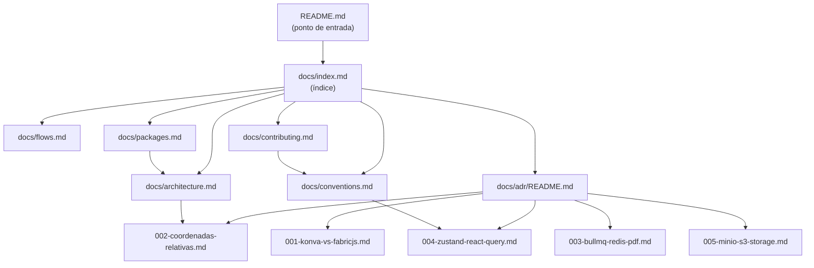
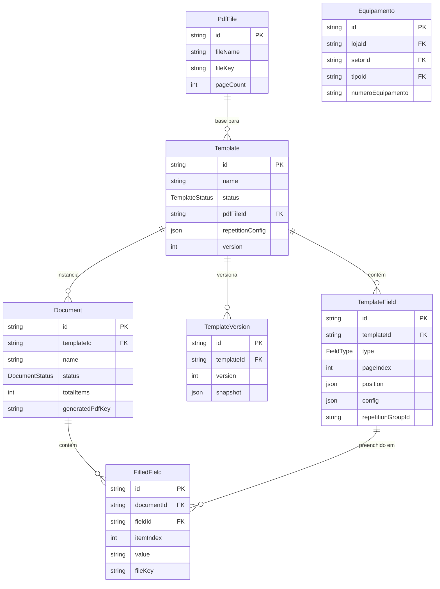

# Design Document — project-documentation

## Visão Geral

Este documento descreve o design da feature `project-documentation`: a criação completa da documentação técnica do RegCheck. O objetivo é produzir um conjunto de arquivos Markdown que permita a um desenvolvedor novo entender o sistema, configurar o ambiente e contribuir sem ajuda externa.

A documentação não é código executável, mas é um artefato de software com estrutura, convenções e critérios de correção verificáveis. O design abaixo define a estrutura, o conteúdo esperado e as propriedades de correção de cada arquivo.

---

## Arquitetura

### Estrutura de Arquivos

```
README.md                        ← ponto de entrada reescrito
docs/
  index.md                       ← índice navegável de toda a documentação
  architecture.md                ← C4, dependências, schema, coordenadas
  flows.md                       ← diagramas de sequência e estado
  conventions.md                 ← padrões de código e convenções
  packages.md                    ← API pública dos pacotes compartilhados
  contributing.md                ← guia de contribuição
  adr/
    README.md                    ← índice de ADRs + template padrão
    001-konva-vs-fabricjs.md
    002-coordenadas-relativas.md
    003-bullmq-redis-pdf.md
    004-zustand-react-query.md
    005-minio-s3-storage.md
```

### Diagrama de Relacionamento entre Documentos

> Mostra como os documentos se referenciam entre si e qual é o ponto de entrada.



---

## Componentes e Interfaces

### Componentes da Documentação

Cada arquivo de documentação tem um propósito único e um público-alvo definido:

| Arquivo | Propósito | Público |
|---|---|---|
| `README.md` | Visão geral, setup, comandos | Qualquer desenvolvedor |
| `docs/index.md` | Índice navegável | Qualquer desenvolvedor |
| `docs/architecture.md` | Estrutura técnica, dependências, schema | Dev que vai modificar o sistema |
| `docs/flows.md` | Fluxos end-to-end com diagramas | Dev debugando ou implementando feature |
| `docs/conventions.md` | Padrões de código | Dev escrevendo código novo |
| `docs/packages.md` | API dos pacotes compartilhados | Dev usando os pacotes |
| `docs/contributing.md` | Workflow de contribuição | Dev abrindo PR |
| `docs/adr/*.md` | Decisões técnicas históricas | Dev propondo mudanças arquiteturais |

### Conteúdo Esperado por Arquivo

#### README.md

O README reescrito deve conter, nesta ordem:

1. Badge de status + descrição de uma linha do sistema
2. Diagrama Mermaid de arquitetura do monorepo (graph LR com todos os pacotes)
3. Diagrama Mermaid de stack tecnológica por camada
4. Tabela de URLs de acesso local
5. Seção de setup (pré-requisitos, clone, `.env`, Docker, migrations, dev)
6. Tabela de comandos essenciais
7. Links para `docs/`
8. Seção de troubleshooting

#### docs/index.md

Índice com links relativos para todos os documentos, agrupados por categoria.

#### docs/architecture.md

1. Diagrama C4 nível 2 (Container Diagram) — Frontend, API, PostgreSQL, Redis, MinIO
2. Diagrama de dependências entre pacotes do monorepo
3. Diagrama ER do schema do banco (erDiagram Mermaid)
4. Tabela de responsabilidades por pacote/app
5. Explicação do sistema de coordenadas relativas (0–1)

#### docs/flows.md

1. Diagrama de estado: ciclo de vida do Template
2. Diagrama de estado: ciclo de vida do Document
3. Diagrama de sequência: criação de Template
4. Diagrama de sequência: geração de PDF (com BullMQ worker)
5. Diagrama de sequência: Editor Visual (Konva)
6. Diagrama de fluxo: RepetitionEngine

#### docs/conventions.md

1. Nomenclatura (arquivos, funções, tipos)
2. Estrutura de pastas por app/pacote
3. Uso de Zod validators
4. React Query vs Zustand
5. Tratamento de erros na API
6. Coordenadas relativas
7. Adição de novos pacotes ao monorepo

#### docs/packages.md

1. `@regcheck/editor-engine`: RepetitionEngine, FieldCloner, SnapGrid, HistoryManager
2. `@regcheck/pdf-engine`: PdfProcessor, PdfGenerator, ImageCompressor
3. `@regcheck/shared`: tipos principais com exemplos
4. `@regcheck/validators`: schemas Zod com exemplos
5. Diagrama de consumo dos pacotes

#### docs/contributing.md

1. Fluxo de desenvolvimento local
2. Convenções de commit
3. Prisma Studio e migrations
4. Adicionando endpoint à API
5. Adicionando componente ao `packages/ui`
6. Checklist de PR

#### docs/adr/README.md

Índice de ADRs + template padrão com campos: Título, Status, Contexto, Decisão, Alternativas Consideradas, Consequências.

---

## Modelos de Dados

A documentação não possui modelos de dados próprios. Os modelos de dados do sistema que serão documentados são:

### Entidades Principais (a serem documentadas em architecture.md)



---

## Correctness Properties

*A property is a characteristic or behavior that should hold true across all valid executions of a system — essentially, a formal statement about what the system should do. Properties serve as the bridge between human-readable specifications and machine-verifiable correctness guarantees.*

Para documentação, as propriedades de correção verificam a **estrutura e completude** dos arquivos gerados: existência de arquivos, presença de conteúdo obrigatório, consistência de links e formatação.

### Property 1: Todos os arquivos de documentação obrigatórios existem

*Para qualquer* execução do gerador de documentação, cada arquivo listado na estrutura obrigatória (`README.md`, `docs/index.md`, `docs/architecture.md`, `docs/flows.md`, `docs/conventions.md`, `docs/packages.md`, `docs/contributing.md`, `docs/adr/README.md`, e os 5 ADRs) deve existir no sistema de arquivos.

**Validates: Requirements 2.1, 3.1, 4.1, 5.1, 5.2, 6.1, 7.1, 8.4**

### Property 2: docs/index.md referencia todos os arquivos em docs/

*Para qualquer* arquivo `.md` presente na pasta `docs/` (incluindo subpastas), `docs/index.md` deve conter um link relativo para esse arquivo.

**Validates: Requirements 8.4, 8.7**

### Property 3: README referencia todos os documentos em docs/

*Para qualquer* arquivo `.md` presente na pasta `docs/` (exceto subpastas de ADR individuais), `README.md` deve conter um link relativo para esse arquivo.

**Validates: Requirements 1.4, 8.3**

### Property 4: Cada pacote tem sua responsabilidade documentada em architecture.md

*Para qualquer* pacote ou aplicação do monorepo (`apps/api`, `apps/web`, `packages/database`, `packages/pdf-engine`, `packages/editor-engine`, `packages/shared`, `packages/validators`, `packages/ui`), `docs/architecture.md` deve conter uma seção ou entrada descrevendo sua responsabilidade.

**Validates: Requirements 2.5**

### Property 5: Cada API pública de pacote está documentada em packages.md

*Para qualquer* símbolo exportado publicamente pelos pacotes compartilhados (`RepetitionEngine`, `FieldCloner`, `SnapGrid`, `HistoryManager`, `PdfProcessor`, `PdfGenerator`, `ImageCompressor`), `docs/packages.md` deve conter uma descrição e exemplo de uso desse símbolo.

**Validates: Requirements 6.2, 6.3**

### Property 6: Cada ADR contém todos os campos do template padrão

*Para qualquer* arquivo em `docs/adr/` (exceto `README.md`), o arquivo deve conter as seções: Título, Status, Contexto, Decisão, Alternativas Consideradas, Consequências.

**Validates: Requirements 5.3, 5.4, 5.5, 5.6, 5.7, 5.9**

### Property 7: Todas as referências cruzadas usam links relativos

*Para qualquer* link em qualquer arquivo de documentação que aponta para outro arquivo de documentação do projeto, o link deve ser relativo (não uma URL absoluta).

**Validates: Requirements 8.2**

### Property 8: Todo bloco Mermaid tem um título ou legenda

*Para qualquer* bloco de código Mermaid (delimitado por ` ```mermaid `) em qualquer arquivo de documentação, deve existir um heading (`##`, `###`) ou texto de legenda imediatamente antes do bloco.

**Validates: Requirements 8.5**

### Property 9: docs/conventions.md cobre todos os tópicos obrigatórios

*Para qualquer* tópico obrigatório da lista (nomenclatura, Zod, React Query, Zustand, errorHandler, coordenadas relativas, adição de pacotes ao monorepo), `docs/conventions.md` deve conter uma seção dedicada a esse tópico.

**Validates: Requirements 4.2, 4.3, 4.4, 4.5, 4.6, 4.7, 4.8**

### Property 10: docs/contributing.md cobre todos os tópicos obrigatórios e tem checklist de PR

*Para qualquer* tópico obrigatório da lista (branch/lint/commit, convenções de commit, Prisma Studio, novo endpoint, novo componente UI), `docs/contributing.md` deve conter uma seção dedicada. Adicionalmente, o arquivo deve conter pelo menos um checklist Markdown (`- [ ]`).

**Validates: Requirements 7.2, 7.3, 7.4, 7.5, 7.6, 7.7**

---

## Tratamento de Erros

Como a documentação é composta de arquivos estáticos, o "tratamento de erros" se aplica ao processo de criação e manutenção:

- **Arquivo ausente**: Se um arquivo obrigatório não for criado, a Property 1 falhará na verificação automatizada.
- **Link quebrado**: Links relativos incorretos serão detectados pela Property 7 e por ferramentas como `markdown-link-check`.
- **Diagrama inválido**: Blocos Mermaid com sintaxe inválida serão detectados pelo renderizador do GitHub ou por `@mermaid-js/mermaid-cli`.
- **Índice desatualizado**: Se um novo arquivo for adicionado sem atualizar `docs/index.md`, a Property 2 falhará.

---

## Estratégia de Testes

### Abordagem Dual

A documentação usa uma abordagem de testes em dois níveis:

**Testes de Exemplo (Unit)**: Verificam casos específicos e concretos.
- Verificar que `README.md` contém um bloco `mermaid` com `graph`
- Verificar que `docs/adr/README.md` contém o template padrão com todos os campos
- Verificar que `docs/flows.md` contém `stateDiagram` com os estados `DRAFT`, `PUBLISHED`, `ARCHIVED`
- Verificar que `docs/contributing.md` contém pelo menos um `- [ ]` (checklist)

**Testes de Propriedade (Property-Based)**: Verificam regras universais sobre todos os arquivos.
- Biblioteca recomendada: **fast-check** (TypeScript/Node.js)
- Mínimo de 100 iterações por teste de propriedade
- Cada teste deve referenciar a propriedade do design com o formato:
  `// Feature: project-documentation, Property N: <texto da propriedade>`

### Configuração dos Testes de Propriedade

```typescript
// Feature: project-documentation, Property 1: todos os arquivos obrigatórios existem
it('todos os arquivos de documentação obrigatórios existem', () => {
  const requiredFiles = [
    'README.md',
    'docs/index.md',
    'docs/architecture.md',
    'docs/flows.md',
    'docs/conventions.md',
    'docs/packages.md',
    'docs/contributing.md',
    'docs/adr/README.md',
    'docs/adr/001-konva-vs-fabricjs.md',
    'docs/adr/002-coordenadas-relativas.md',
    'docs/adr/003-bullmq-redis-pdf.md',
    'docs/adr/004-zustand-react-query.md',
    'docs/adr/005-minio-s3-storage.md',
  ];
  for (const file of requiredFiles) {
    expect(fs.existsSync(path.join(repoRoot, file))).toBe(true);
  }
});

// Feature: project-documentation, Property 2: docs/index.md referencia todos os arquivos em docs/
fc.assert(fc.property(
  fc.constantFrom(...getAllDocsFiles()),
  (docFile) => {
    const indexContent = fs.readFileSync('docs/index.md', 'utf-8');
    return indexContent.includes(docFile);
  }
), { numRuns: 100 });
```

### Ferramentas de Validação Complementares

- `markdown-link-check`: valida links relativos e externos
- `@mermaid-js/mermaid-cli`: valida sintaxe dos diagramas Mermaid
- `markdownlint`: valida formatação consistente dos arquivos Markdown
