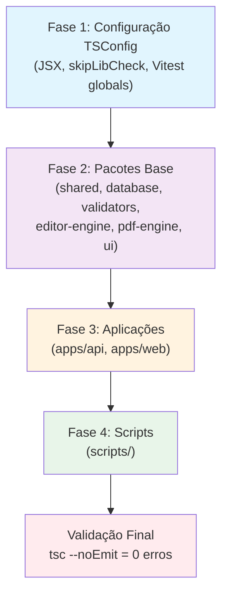
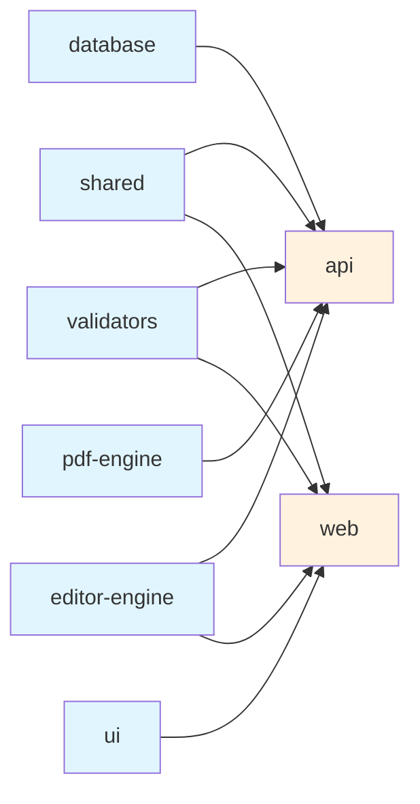

# Documento de Design — Refatoração TypeScript Strict

## Visão Geral

Este documento descreve a arquitetura e estratégia técnica para eliminar todos os 1794 erros de compilação TypeScript no monorepo **regcheck**, mantendo o modo `strict` completo habilitado. A refatoração é organizada em camadas de prioridade baseadas na dependência entre erros: primeiro a infraestrutura de configuração (TSConfig/JSX), depois a base de tipos compartilhados, e por fim as correções arquivo-a-arquivo nas aplicações e scripts.

### Decisões de Design

1. **Abordagem bottom-up por dependência**: Corrigir primeiro os pacotes-folha (`shared`, `database`, `validators`) antes das aplicações (`api`, `web`) que os consomem, evitando retrabalho.
2. **Configuração JSX no TSConfig raiz**: Adicionar `"jsx": "react-jsx"` ao `tsconfig.json` raiz como fallback, mantendo overrides nos filhos (`"preserve"` em `apps/web` para Next.js). Isso elimina os 1024 erros TS17004 de uma vez.
3. **`skipLibCheck: true` seletivo**: Habilitar `skipLibCheck: true` apenas nos TSConfigs filhos que sofrem com conflitos de tipos em `node_modules` (ex: `apps/api` por causa do ioredis/bullmq), documentando o motivo. O TSConfig raiz mantém `skipLibCheck: false`.
4. **Tipos globais do Vitest via `tsconfig.json`**: Adicionar `"types": ["vitest/globals"]` nos TSConfigs dos pacotes que usam `globals: true` no Vitest, em vez de criar arquivos `.d.ts` manuais.
5. **`unknown` em vez de `any`**: Toda correção de tipo implícito `any` deve usar tipos concretos inferidos do uso real. Quando impossível, usar `unknown` com type guard. Nunca `any` sem justificativa documentada.
6. **Tipos reutilizáveis em `packages/shared`**: Tipos comuns entre `api` e `web` ficam em `packages/shared/src/types/`. Tipos específicos de um pacote ficam em arquivo `types.ts` local.

## Arquitetura

A refatoração segue uma arquitetura em 4 fases sequenciais, onde cada fase desbloqueia a próxima:



### Ordem de Dependência dos Pacotes



## Componentes e Interfaces

### Componente 1: Configuração TSConfig (Fase 1)

**Responsabilidade**: Eliminar erros de configuração que afetam múltiplos arquivos de uma vez.

**Alterações no `tsconfig.json` raiz**:
```jsonc
{
  "compilerOptions": {
    // ADICIONAR: fallback JSX para pacotes que contêm .tsx
    "jsx": "react-jsx",
    // ... flags existentes mantidas
  }
}
```

**Alterações em `apps/web/tsconfig.json`** (já correto — `"jsx": "preserve"` para Next.js):
```jsonc
{
  "compilerOptions": {
    "jsx": "preserve",  // Override: Next.js exige preserve
    // ADICIONAR: tipos do Vitest para testes
    "types": ["vitest/globals"]
  }
}
```

**Alterações em `apps/api/tsconfig.json`**:
```jsonc
{
  "compilerOptions": {
    // ADICIONAR: resolver conflitos ioredis/bullmq
    "skipLibCheck": true,  // Justificativa: conflito exactOptionalPropertyTypes entre ioredis 5.x e bullmq
    // ADICIONAR: tipos do Vitest
    "types": ["vitest/globals"]
  }
}
```

**Alterações em `scripts/tsconfig.json`** (já tem `skipLibCheck: true`):
```jsonc
{
  "compilerOptions": {
    // ADICIONAR: tipos do Vitest
    "types": ["vitest/globals"]
  }
}
```

**Impacto estimado**: ~1024 erros TS17004 + ~21 erros TS2304 (Vitest globals) + ~19 erros TS2375/TS2412 (ioredis) = ~1064 erros eliminados.

### Componente 2: Tipos Compartilhados (Fase 2)

**Responsabilidade**: Definir e exportar tipos reutilizáveis que serão consumidos pelas aplicações.

**Estrutura de `packages/shared/src/types/`**:
```
packages/shared/src/types/
├── api.ts          # ApiResponse, ApiError, PaginatedResponse (existente)
├── document.ts     # Tipos de documento (existente)
├── equipment.ts    # Tipos de equipamento (existente)
├── field.ts        # TemplateField, FieldScope (existente)
├── pagination.ts   # PaginationParams (existente)
├── template.ts     # Tipos de template (existente)
└── common.ts       # NOVO: tipos utilitários compartilhados
```

**Novo arquivo `common.ts`** — tipos utilitários para padrões recorrentes:
```typescript
/** Tipo para dados JSON vindos do Prisma (substitui `unknown` e `any` em campos JSON) */
export type JsonValue = string | number | boolean | null | JsonValue[] | { [key: string]: JsonValue };

/** Tipo para metadados de documento (substitui `as any` em metadata) */
export interface DocumentMetadata {
  assignments?: Array<{
    itemIndex: number;
    setorId: string;
    setorNome: string;
    equipamentoId: string;
    numeroEquipamento?: string;
  }>;
  itemsPerPage?: number;
  totalPages?: number;
  fillMode?: string;
  totalSlots?: number;
}

/** Tipo para posição de campo no canvas */
export interface FieldPosition {
  x: number;
  y: number;
  width: number;
  height: number;
}

/** Tipo para configuração de campo */
export interface FieldConfig {
  label?: string;
  placeholder?: string;
  required?: boolean;
  tipoEquipamentoId?: string;
  [key: string]: JsonValue | undefined;
}

/** Tipo utilitário: torna propriedades opcionais realmente ausentes (compatível com exactOptionalPropertyTypes) */
export type StrictOptional<T, K extends keyof T> = Omit<T, K> & {
  [P in K]?: T[P];
};
```

### Componente 3: Padrões de Correção por Categoria de Erro

**TS7006 / TS7053 — Implicit `any`**:
```typescript
// ANTES (TS7006):
app.use((err, req, res, next) => { ... });

// DEPOIS:
app.use((err: Error, req: Request, res: Response, next: NextFunction) => { ... });

// ANTES (TS7053):
const value = obj[key]; // Element implicitly has 'any' type

// DEPOIS:
const record: Record<string, string> = obj;
const value = record[key]; // string | undefined (com noUncheckedIndexedAccess)
```

**TS18048 / TS2532 / TS18049 — Null safety**:
```typescript
// ANTES (TS18048):
const name = user.profile.name; // 'profile' is possibly undefined

// DEPOIS — opção 1: guard clause (preferida para lógica de negócio):
if (!user.profile) throw new AppError(404, 'Profile not found', 'NOT_FOUND');
const name = user.profile.name;

// DEPOIS — opção 2: optional chaining (para valores opcionais):
const name = user.profile?.name ?? 'Sem nome';

// DEPOIS — opção 3: narrowing com noUncheckedIndexedAccess:
const item = array[index];
if (item === undefined) continue;
// item agora é T, não T | undefined
```

**TS2345 / TS2322 / TS2339 — Incompatibilidades de tipo**:
```typescript
// ANTES (TS2339): Property 'config' does not exist on type
const tipoId = (f.config as any)?.tipoEquipamentoId;

// DEPOIS: usar tipo definido
const config = f.config as FieldConfig | null;
const tipoId = config?.tipoEquipamentoId;

// ANTES (TS2345): Argument not assignable
metadata: { assignments } as unknown as Prisma.InputJsonValue

// DEPOIS: usar satisfies ou tipo intermediário
metadata: { assignments } satisfies DocumentMetadata as unknown as Prisma.InputJsonValue
// Nota: o `as unknown as Prisma.InputJsonValue` é necessário pela API do Prisma
// e deve ser documentado com comentário justificando
```

**TS6133 — Variáveis não utilizadas**:
```typescript
// ANTES:
import { unused, used } from './module';
const { a, b, c } = destructured; // 'b' nunca usado

// DEPOIS:
import { used } from './module';
const { a, _b, c } = destructured; // prefixo _ indica intencional
```

**TS2375 / TS2412 — exactOptionalPropertyTypes**:
```typescript
// ANTES:
interface Options { timeout?: number; }
const opts: Options = { timeout: undefined }; // TS2375

// DEPOIS — opção 1: omitir a propriedade:
const opts: Options = {};

// DEPOIS — opção 2: ajustar a interface se undefined é valor válido:
interface Options { timeout?: number | undefined; }
```

**TS2454 / TS2448 — Fluxo de controle**:
```typescript
// ANTES (TS2454):
let result: string;
if (condition) result = 'a';
console.log(result); // Used before assigned

// DEPOIS:
let result: string | undefined;
if (condition) result = 'a';
if (result !== undefined) console.log(result);
// OU inicializar com valor padrão:
let result = '';
```

### Componente 4: Declarações de Tipos para Módulos Externos

**Arquivo `apps/web/src/types/modules.d.ts`**:
```typescript
// Módulos sem tipos disponíveis
declare module 'pdfjs-dist/build/pdf.worker.min.mjs' {
  const workerSrc: string;
  export default workerSrc;
}
```

**Arquivo `apps/api/src/types/globals.d.ts`** (se necessário):
```typescript
// Extensões de tipos para Express
declare namespace Express {
  interface Request {
    // propriedades customizadas adicionadas por middleware
  }
}
```

## Modelos de Dados

A refatoração não altera modelos de dados existentes. As mudanças são exclusivamente na camada de tipos TypeScript:

### Tipos Novos a Criar

| Tipo | Localização | Propósito |
|------|-------------|-----------|
| `DocumentMetadata` | `packages/shared/src/types/common.ts` | Substituir `as any` em `doc.metadata` |
| `FieldConfig` | `packages/shared/src/types/common.ts` | Tipar `field.config` (hoje `unknown`) |
| `FieldPosition` | `packages/shared/src/types/common.ts` | Tipar `field.position` (hoje `unknown`) |
| `JsonValue` | `packages/shared/src/types/common.ts` | Tipo recursivo para campos JSON do Prisma |
| `StrictOptional<T,K>` | `packages/shared/src/types/common.ts` | Utilitário para `exactOptionalPropertyTypes` |

### Tipos Existentes a Estender

| Tipo | Localização | Alteração |
|------|-------------|-----------|
| `DbField.position` | `apps/api/src/services/document-service.ts` | `unknown` → `FieldPosition` |
| `DbField.config` | `apps/api/src/services/document-service.ts` | `unknown` → `FieldConfig` |
| `BindingScope` | `packages/editor-engine` | Verificar se aceita `undefined` em propriedades opcionais |

### Mapeamento de Erros por Área

| Área | Arquivos | Erros Estimados | Fase |
|------|----------|-----------------|------|
| Configuração TSConfig | 4 arquivos | ~1064 | Fase 1 |
| `packages/*` | 8 arquivos | ~30 | Fase 2 |
| `apps/api` | 29 arquivos | ~350 | Fase 3 |
| `apps/web` | 46 arquivos | ~300 | Fase 3 |
| `scripts/` | 25 arquivos | ~50 | Fase 4 |
| `node_modules` (via skipLibCheck) | 6 arquivos | ~0 (resolvido na Fase 1) | Fase 1 |

