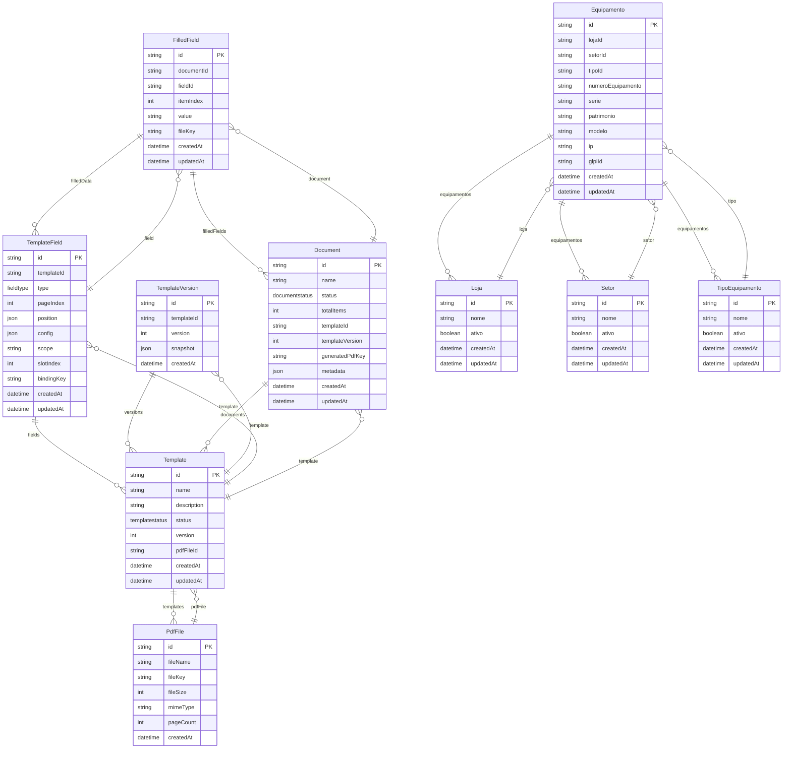

# Modelagem de Dados

Este documento descreve o modelo de dados do sistema RegCheck, incluindo todas as entidades, relacionamentos e enumerações.

**Fonte:** prisma-parser
**Gerado em:** 23/04/2026, 12:20:29

## Visão Geral

O sistema possui **10 entidades** e **3 enumerações**.

### Entidades

- **PdfFile**: Arquivos PDF originais enviados pelo usuário
- **Template**: Templates de documentos PDF com campos configuráveis
- **TemplateVersion**: Entidade do sistema
- **TemplateField**: Campos de preenchimento dos templates
- **Document**: Documentos criados a partir de templates
- **FilledField**: Entidade do sistema
- **Loja**: Lojas onde os equipamentos estão localizados
- **Setor**: Setores dentro das lojas
- **TipoEquipamento**: Tipos de equipamentos
- **Equipamento**: Equipamentos cadastrados no sistema

## Diagrama de Relacionamento (ERD)

O diagrama abaixo mostra todas as entidades e seus relacionamentos:

## Detalhamento das Entidades

### PdfFile

Uploaded PDF files used as template bases

**Tabela:** `pdf_files`

| Campo | Tipo | Obrigatório | Descrição |
|---|---|---|---|
| id | Texto | Sim | Identificador único. Chave primária. Padrão: uuid() |
| fileName | Texto | Sim | - |
| fileKey | Texto | Sim | Valor único |
| fileSize | Inteiro | Sim | - |
| mimeType | Texto | Sim | - |
| pageCount | Inteiro | Sim | - |
| createdAt | Data/Hora | Sim | Data de criação. Padrão: now() |

**Relacionamentos:**

- **templates**: Lista de `Template`

### Template

Document template definitions

**Tabela:** `templates`

| Campo | Tipo | Obrigatório | Descrição |
|---|---|---|---|
| id | Texto | Sim | Identificador único. Chave primária. Padrão: uuid() |
| name | Texto | Sim | Nome |
| description | Texto | Não | Descrição |
| status | TemplateStatus | Sim | Status. Padrão: DRAFT |
| version | Inteiro | Sim | Padrão: 1 |
| pdfFileId | Texto | Sim | - |
| createdAt | Data/Hora | Sim | Data de criação. Padrão: now() |
| updatedAt | Data/Hora | Sim | Data de atualização |

**Relacionamentos:**

- **pdfFile**: Referência para `PdfFile`
- **fields**: Lista de `TemplateField`
- **versions**: Lista de `TemplateVersion`
- **documents**: Lista de `Document`

### TemplateVersion

Version history for templates

**Tabela:** `template_versions`

| Campo | Tipo | Obrigatório | Descrição |
|---|---|---|---|
| id | Texto | Sim | Identificador único. Chave primária. Padrão: uuid() |
| templateId | Texto | Sim | - |
| version | Inteiro | Sim | - |
| snapshot | JSON | Sim | - |
| createdAt | Data/Hora | Sim | Data de criação. Padrão: now() |

**Relacionamentos:**

- **template**: Referência para `Template`

### TemplateField

Fields defined on a template page

**Tabela:** `template_fields`

| Campo | Tipo | Obrigatório | Descrição |
|---|---|---|---|
| id | Texto | Sim | Identificador único. Chave primária. Padrão: uuid() |
| templateId | Texto | Sim | - |
| type | FieldType | Sim | - |
| pageIndex | Inteiro | Sim | - |
| position | JSON | Sim | - |
| config | JSON | Sim | - |
| scope | Texto | Sim | Padrão: "item" |
| slotIndex | Inteiro | Não | - |
| bindingKey | Texto | Não | - |
| createdAt | Data/Hora | Sim | Data de criação. Padrão: now() |
| updatedAt | Data/Hora | Sim | Data de atualização |

**Relacionamentos:**

- **template**: Referência para `Template`
- **filledData**: Lista de `FilledField`

### Document

A filled document instance

**Tabela:** `documents`

| Campo | Tipo | Obrigatório | Descrição |
|---|---|---|---|
| id | Texto | Sim | Identificador único. Chave primária. Padrão: uuid() |
| name | Texto | Sim | Nome |
| status | DocumentStatus | Sim | Status. Padrão: DRAFT |
| totalItems | Inteiro | Sim | - |
| templateId | Texto | Sim | - |
| templateVersion | Inteiro | Sim | - |
| generatedPdfKey | Texto | Não | - |
| metadata | JSON | Não | - |
| createdAt | Data/Hora | Sim | Data de criação. Padrão: now() |
| updatedAt | Data/Hora | Sim | Data de atualização |

**Relacionamentos:**

- **template**: Referência para `Template`
- **filledFields**: Lista de `FilledField`

### FilledField

Data filled into a field for a specific item

**Tabela:** `filled_fields`

| Campo | Tipo | Obrigatório | Descrição |
|---|---|---|---|
| id | Texto | Sim | Identificador único. Chave primária. Padrão: uuid() |
| documentId | Texto | Sim | - |
| fieldId | Texto | Sim | - |
| itemIndex | Inteiro | Sim | - |
| value | Texto | Sim | - |
| fileKey | Texto | Não | - |
| createdAt | Data/Hora | Sim | Data de criação. Padrão: now() |
| updatedAt | Data/Hora | Sim | Data de atualização |

**Relacionamentos:**

- **document**: Referência para `Document`
- **field**: Referência para `TemplateField`

### Loja

Store locations

**Tabela:** `lojas`

| Campo | Tipo | Obrigatório | Descrição |
|---|---|---|---|
| id | Texto | Sim | Identificador único. Chave primária. Padrão: uuid() |
| nome | Texto | Sim | Valor único |
| ativo | Booleano | Sim | Indica se está ativo. Padrão: true |
| createdAt | Data/Hora | Sim | Data de criação. Padrão: now() |
| updatedAt | Data/Hora | Sim | Data de atualização |

**Relacionamentos:**

- **equipamentos**: Lista de `Equipamento`

### Setor

Sectors within a store

**Tabela:** `setores`

| Campo | Tipo | Obrigatório | Descrição |
|---|---|---|---|
| id | Texto | Sim | Identificador único. Chave primária. Padrão: uuid() |
| nome | Texto | Sim | Valor único |
| ativo | Booleano | Sim | Indica se está ativo. Padrão: true |
| createdAt | Data/Hora | Sim | Data de criação. Padrão: now() |
| updatedAt | Data/Hora | Sim | Data de atualização |

**Relacionamentos:**

- **equipamentos**: Lista de `Equipamento`

### TipoEquipamento

Equipment type classification

**Tabela:** `tipos_equipamento`

| Campo | Tipo | Obrigatório | Descrição |
|---|---|---|---|
| id | Texto | Sim | Identificador único. Chave primária. Padrão: uuid() |
| nome | Texto | Sim | Valor único |
| ativo | Booleano | Sim | Indica se está ativo. Padrão: true |
| createdAt | Data/Hora | Sim | Data de criação. Padrão: now() |
| updatedAt | Data/Hora | Sim | Data de atualização |

**Relacionamentos:**

- **equipamentos**: Lista de `Equipamento`

### Equipamento

Equipment registry

**Tabela:** `equipamentos`

| Campo | Tipo | Obrigatório | Descrição |
|---|---|---|---|
| id | Texto | Sim | Identificador único. Chave primária. Padrão: uuid() |
| lojaId | Texto | Sim | - |
| setorId | Texto | Sim | - |
| tipoId | Texto | Sim | - |
| numeroEquipamento | Texto | Sim | - |
| serie | Texto | Não | - |
| patrimonio | Texto | Não | - |
| modelo | Texto | Não | - |
| ip | Texto | Não | - |
| glpiId | Texto | Não | - |
| createdAt | Data/Hora | Sim | Data de criação. Padrão: now() |
| updatedAt | Data/Hora | Sim | Data de atualização |

**Relacionamentos:**

- **loja**: Referência para `Loja`
- **setor**: Referência para `Setor`
- **tipo**: Referência para `TipoEquipamento`

## Enumerações

### TemplateStatus

Valores possíveis:

- **DRAFT**: Rascunho, em edição
- **PUBLISHED**: Publicado, disponível para uso
- **ARCHIVED**: não identificado

### FieldType

Valores possíveis:

- **TEXT**: Campo de texto livre
- **IMAGE**: Imagem
- **SIGNATURE**: não identificado
- **CHECKBOX**: Caixa de seleção

### DocumentStatus

Valores possíveis:

- **DRAFT**: Rascunho, em preenchimento
- **IN_PROGRESS**: não identificado
- **COMPLETED**: Preenchido, pronto para gerar PDF
- **GENERATING**: PDF em geração
- **GENERATED**: não identificado
- **ERROR**: não identificado

## Relacionamentos

O sistema possui os seguintes relacionamentos entre entidades:

| De | Para | Tipo | Descrição |
|---|---|---|---|
| Template | PdfFile | 1:N | Template baseado em arquivo PDF |
| Template | PdfFile | N:1 | Template baseado em arquivo PDF |
| TemplateField | Template | 1:N | não identificado |
| TemplateVersion | Template | 1:N | não identificado |
| Document | Template | 1:N | não identificado |
| TemplateVersion | Template | N:1 | não identificado |
| TemplateField | Template | N:1 | não identificado |
| FilledField | TemplateField | 1:N | não identificado |
| Document | Template | N:1 | não identificado |
| FilledField | Document | 1:N | não identificado |
| FilledField | Document | N:1 | não identificado |
| FilledField | TemplateField | N:1 | não identificado |
| Equipamento | Loja | 1:N | Equipamento pertence a uma loja |
| Equipamento | Setor | 1:N | Equipamento pertence a um setor |
| Equipamento | TipoEquipamento | 1:N | Equipamento possui um tipo |
| Equipamento | Loja | N:1 | Equipamento pertence a uma loja |
| Equipamento | Setor | N:1 | Equipamento pertence a um setor |
| Equipamento | TipoEquipamento | N:1 | Equipamento possui um tipo |

## Referências

- Schema Prisma: `packages/database/prisma/schema.prisma`
- Documentação Prisma: https://www.prisma.io/docs

