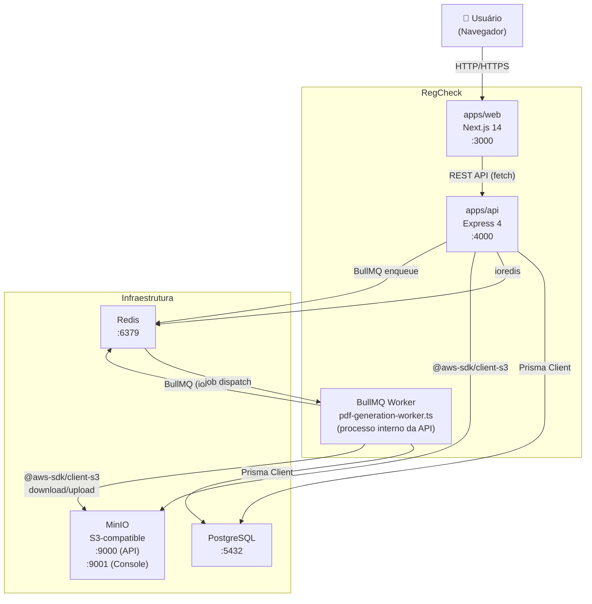
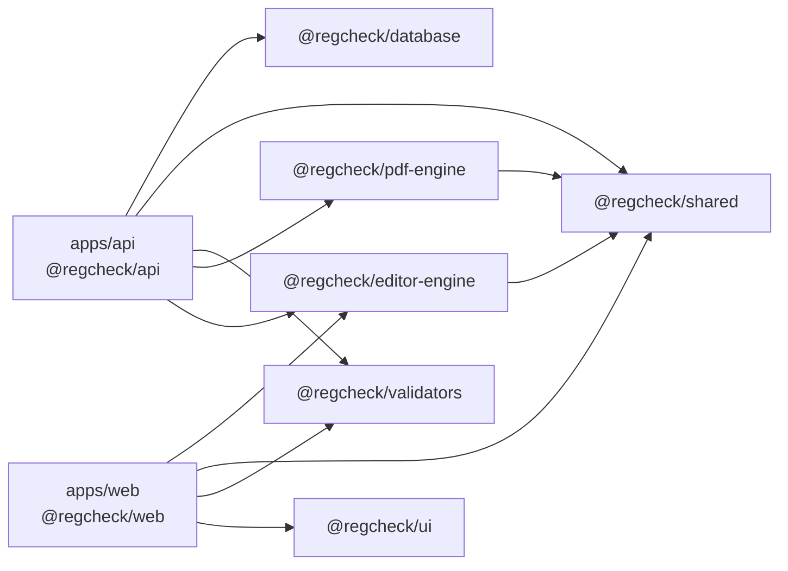
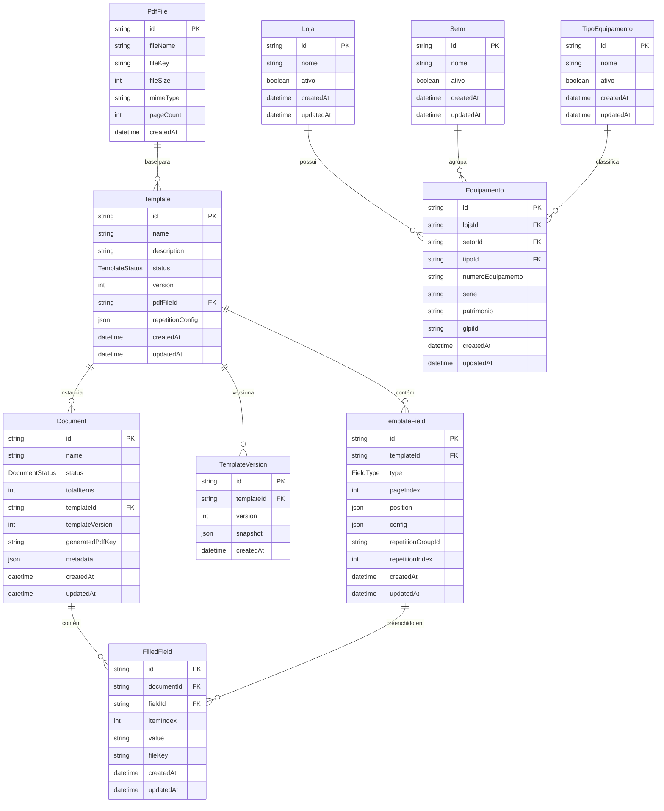

# Arquitetura do Sistema — RegCheck

Este documento descreve a arquitetura técnica do RegCheck: como os containers se comunicam, como os pacotes do monorepo se relacionam, o schema do banco de dados e as convenções de coordenadas usadas no editor visual.

---

## Diagrama C4 Nível 2 — Container Diagram

> Visão dos containers do sistema RegCheck e suas conexões. Cada container é um processo ou serviço independente.



---

## Diagrama de Dependências entre Pacotes do Monorepo

> Mostra quem importa quem entre os apps e pacotes internos do monorepo. Setas indicam dependência (A → B significa "A importa B").



---

## Diagrama ER — Schema do Banco de Dados

> Entidades do banco de dados PostgreSQL gerenciadas pelo Prisma. Relacionamentos mostram cardinalidade real do schema.



---

## Responsabilidades por Pacote e App

| Pacote / App              | Responsabilidade                                                                                                                                                                                                  |
| ------------------------- | ----------------------------------------------------------------------------------------------------------------------------------------------------------------------------------------------------------------- |
| `apps/api`                | Servidor Express que expõe a REST API. Gerencia rotas, middlewares, serviços de negócio, upload de arquivos e enfileiramento de jobs BullMQ. Porta 4000.                                                          |
| `apps/web`                | Frontend Next.js 14 (App Router). Contém o editor visual Konva, as páginas de preenchimento de documentos, cadastros de equipamentos e o polling de status de geração. Porta 3000.                                |
| `@regcheck/database`      | Exporta o `PrismaClient` configurado e os tipos gerados pelo Prisma. É o único ponto de acesso ao banco de dados PostgreSQL.                                                                                      |
| `@regcheck/pdf-engine`    | Processa PDFs com `pdf-lib`: duplica páginas conforme o layout de repetição, aplica overlays de campos (texto, imagem, assinatura, checkbox) e comprime imagens com `sharp`.                                      |
| `@regcheck/editor-engine` | Lógica pura do editor visual: `RepetitionEngine` (calcula layout de páginas), `FieldCloner` (clona campos para itens), `SnapGrid` (alinhamento por grade) e `HistoryManager` (undo/redo). Sem dependências de UI. |
| `@regcheck/shared`        | Tipos TypeScript compartilhados entre todos os pacotes: `TemplateField`, `FieldPosition`, `RepetitionConfig`, `FilledFieldData`, `ApiResponse<T>`, enums `FieldType`, `TemplateStatus`, `DocumentStatus`.         |
| `@regcheck/validators`    | Schemas Zod para validação de entrada da API e do frontend: `templateCreateSchema`, `documentCreateSchema`, `equipamentoCreateSchema`, entre outros.                                                              |
| `@regcheck/ui`            | Componentes React reutilizáveis com Tailwind CSS: botões, inputs, tabelas, modais. Usa `class-variance-authority` para variantes e `tailwind-merge` para composição de classes.                                   |

---

## Sistema de Coordenadas Relativas (0–1)

O RegCheck armazena as posições dos campos como **frações da dimensão da página**, não como pixels ou pontos absolutos. Isso garante que os campos permaneçam corretamente posicionados mesmo que o PDF base seja substituído por uma versão com dimensões diferentes.

### Estrutura de `FieldPosition`

```typescript
interface FieldPosition {
  x: number; // fração horizontal: 0 = borda esquerda, 1 = borda direita
  y: number; // fração vertical: 0 = topo, 1 = base (coordenada de tela)
  width: number; // largura como fração da largura da página
  height: number; // altura como fração da altura da página
}
```

### Fórmula de Conversão para Coordenadas Absolutas

A conversão de coordenadas relativas para absolutas acontece exclusivamente no `@regcheck/pdf-engine`, no momento de gerar o PDF. O sistema de coordenadas do `pdf-lib` tem origem no canto inferior esquerdo da página, por isso a fórmula inverte o eixo Y:

```
absX = pos.x * pageWidth
absY = pageHeight - (pos.y * pageHeight) - (pos.height * pageHeight)
```

Onde:

- `pos.x`, `pos.y`, `pos.width`, `pos.height` são os valores relativos (0–1) armazenados no banco
- `pageWidth` e `pageHeight` são as dimensões reais da página em pontos PDF (obtidas via `page.getSize()`)
- `absX` e `absY` são as coordenadas absolutas passadas ao `pdf-lib` para posicionar o campo

### Regra de Ouro

> Nunca armazene coordenadas absolutas no banco de dados. A conversão para absoluto ocorre **apenas** no `@regcheck/pdf-engine` durante a geração do PDF, e no editor visual apenas para renderização temporária na tela.

Para mais contexto sobre essa decisão, veja [docs/adr/002-coordenadas-relativas.md](./adr/002-coordenadas-relativas.md).
