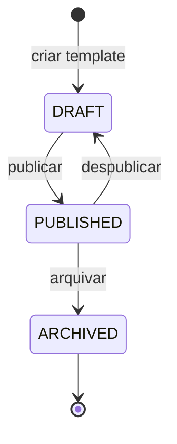
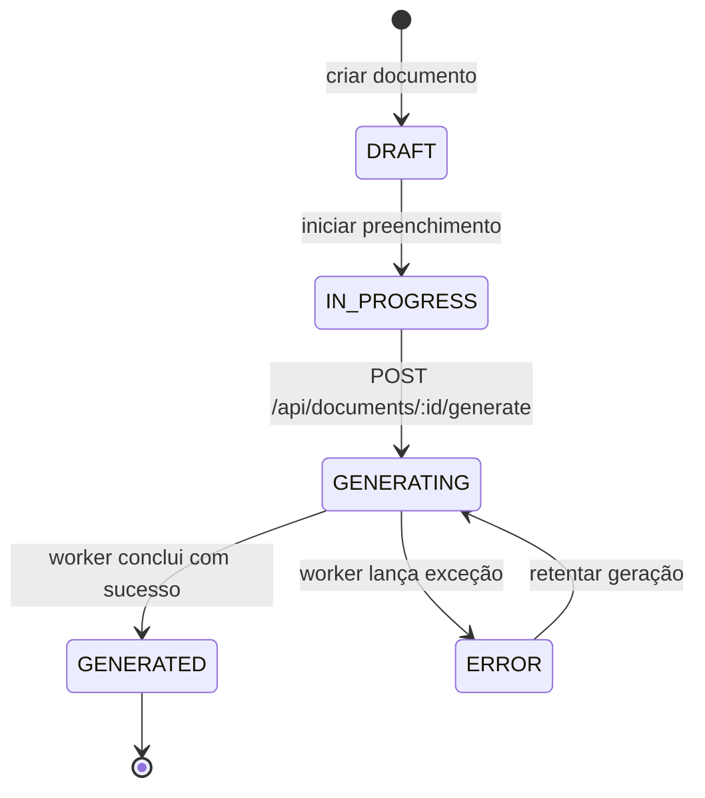
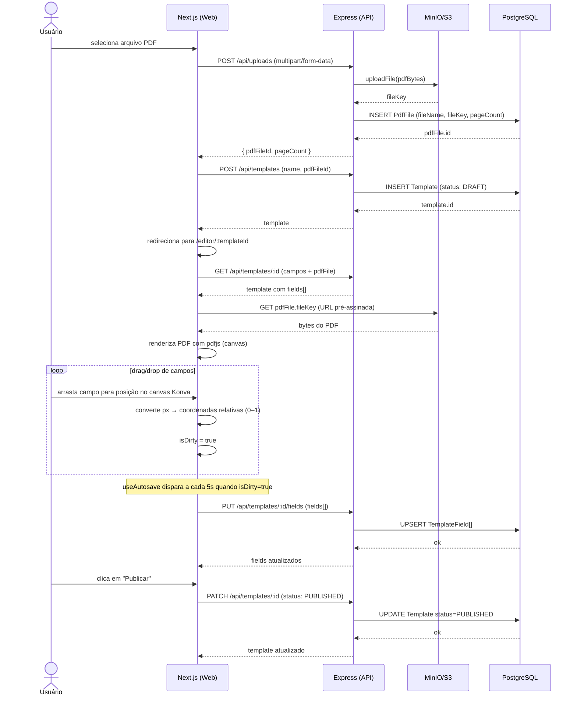
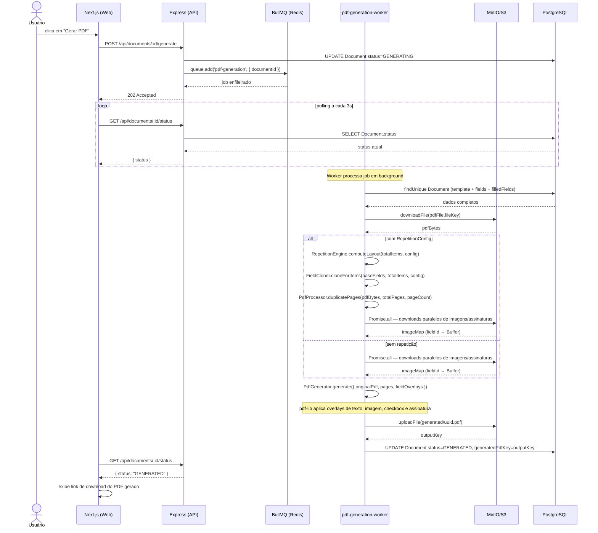
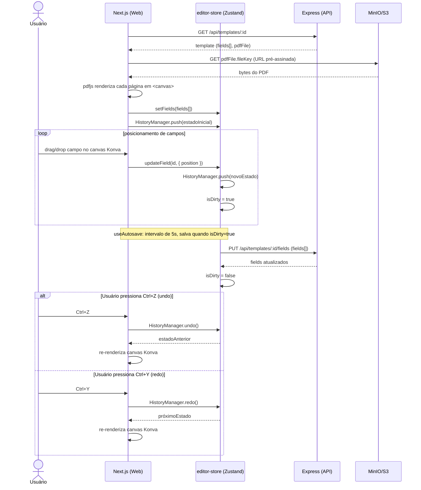
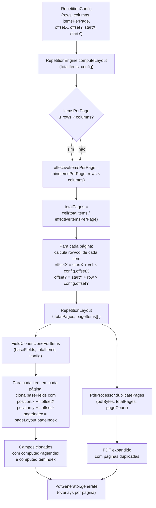

# Fluxos Principais do Sistema

Este documento descreve os fluxos end-to-end do RegCheck com diagramas de estado, sequência e fluxo. Use-o para rastrear uma funcionalidade do início ao fim sem precisar ler o código-fonte.

---

## Ciclo de Vida do Template

Diagrama de estado mostrando as transições possíveis de um Template desde sua criação até o arquivamento.

---

## Ciclo de Vida do Document

Diagrama de estado mostrando as transições de um Document desde o preenchimento até a geração do PDF final (ou erro).

---

## Criação de Template

Diagrama de sequência do fluxo completo de criação de um template: do upload do PDF base até a publicação com campos posicionados.

---

## Geração de PDF

Diagrama de sequência do fluxo de geração assíncrona de PDF via BullMQ, incluindo o polling de status pelo frontend.

---

## Editor Visual

Diagrama de sequência do fluxo do Editor Visual: carregamento do template, renderização do PDF com pdfjs, posicionamento de campos via Konva, autosave e undo/redo.

---

## RepetitionEngine — Cálculo de Layout e Clonagem de Campos

Diagrama de fluxo explicando como o `RepetitionEngine` transforma uma `RepetitionConfig` em campos clonados distribuídos por páginas.

