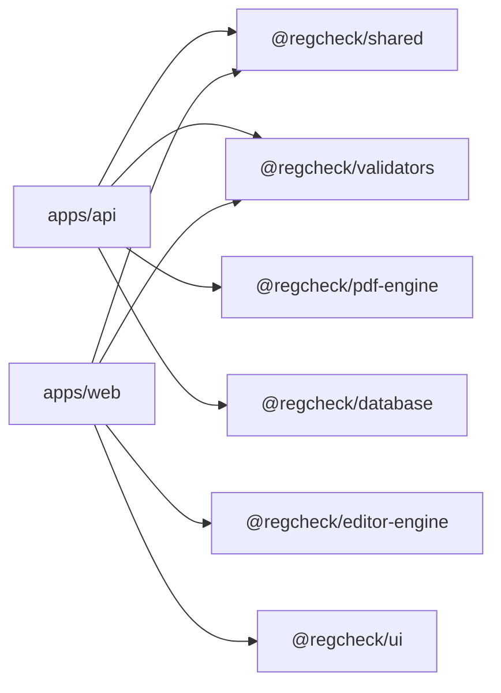

# API dos Pacotes Compartilhados

Este documento descreve a API pública de cada pacote compartilhado do monorepo RegCheck. Use-o como referência rápida antes de ler o código-fonte.

## Diagrama de Consumo dos Pacotes

> Mostra como `apps/api` e `apps/web` consomem os pacotes compartilhados.



---

## `@regcheck/editor-engine`

Pacote responsável pelo cálculo de layout de repetição, clonagem de campos, snap-to-grid e histórico de undo/redo no editor visual.

**Importação:**

```typescript
import { RepetitionEngine, FieldCloner, SnapGrid, HistoryManager } from '@regcheck/editor-engine';
```

---

### `RepetitionEngine`

Calcula como os itens são distribuídos em páginas com base em uma `RepetitionConfig`.

#### `RepetitionEngine.computeLayout(totalItems, config)`

```typescript
static computeLayout(totalItems: number, config: RepetitionConfig): RepetitionLayout
```

Retorna um `RepetitionLayout` com o total de páginas necessárias e a posição de cada item em cada página.

**Exemplo — 6 equipamentos em grid 2×2 (4 por página):**

```typescript
import { RepetitionEngine } from '@regcheck/editor-engine';

const config = {
  itemsPerPage: 4,
  columns: 2,
  rows: 2,
  offsetX: 0.5,   // cada coluna ocupa 50% da largura
  offsetY: 0.45,  // cada linha ocupa 45% da altura
  startX: 0.02,
  startY: 0.05,
};

const layout = RepetitionEngine.computeLayout(6, config);
// layout.totalPages === 2
// layout.pageItems[0].items → itens 0, 1, 2, 3 (página 0)
// layout.pageItems[1].items → itens 4, 5 (página 1)
// layout.pageItems[0].items[1] → { itemIndex: 1, row: 0, col: 1, offsetX: 0.52, offsetY: 0.05 }
```

#### `RepetitionEngine.validate(config)`

```typescript
static validate(config: RepetitionConfig): string[]
```

Valida se a configuração é internamente consistente. Retorna array de mensagens de erro (vazio se válido).

```typescript
const errors = RepetitionEngine.validate({
  itemsPerPage: 10,
  columns: 2,
  rows: 2,  // capacidade = 4, mas itemsPerPage = 10
  offsetX: 0.5,
  offsetY: 0.45,
});
// errors[0] === 'itemsPerPage (10) exceeds grid capacity (2 × 2 = 4)'
```

---

### `FieldCloner`

Clona campos base para todos os itens de um layout de repetição, calculando as posições absolutas de cada clone.

#### `FieldCloner.cloneForItems(baseFields, totalItems, config)`

```typescript
static cloneForItems(
  baseFields: TemplateField[],
  totalItems: number,
  config: RepetitionConfig,
): Array<TemplateField & { computedItemIndex: number; computedPageIndex: number }>
```

**Exemplo — clonar campo "Número do Equipamento" para 3 itens:**

```typescript
import { FieldCloner } from '@regcheck/editor-engine';

const baseField = {
  id: 'field-numero',
  type: 'text',
  pageIndex: 0,
  position: { x: 0.05, y: 0.10, width: 0.40, height: 0.05 },
  config: { label: 'Número do Equipamento', required: true },
  createdAt: '2024-01-01T00:00:00Z',
  updatedAt: '2024-01-01T00:00:00Z',
};

const config = {
  itemsPerPage: 2,
  columns: 1,
  rows: 2,
  offsetX: 0,
  offsetY: 0.45,
};

const clones = FieldCloner.cloneForItems([baseField], 3, config);
// clones[0] → id: 'field-numero_item0', pageIndex: 0, position.y: 0.10, computedItemIndex: 0
// clones[1] → id: 'field-numero_item1', pageIndex: 0, position.y: 0.55, computedItemIndex: 1
// clones[2] → id: 'field-numero_item2', pageIndex: 1, position.y: 0.10, computedItemIndex: 2
```

---

### `SnapGrid`

Implementa snap-to-grid para o editor visual. Coordenadas em pixels são arredondadas para o ponto de grade mais próximo.

#### Construtor e métodos principais

```typescript
const grid = new SnapGrid({ cellSize: 10, enabled: true });

// Snap de um valor único
grid.snap(23);           // → 20
grid.snap(26);           // → 30

// Snap de posição x,y
grid.snapPosition(23, 47);  // → { x: 20, y: 50 }

// Snap de dimensões
grid.snapSize(43, 18);   // → { width: 40, height: 20 }

// Controle em tempo de execução
grid.setEnabled(false);  // desativa snap
grid.setCellSize(5);     // muda tamanho da célula
grid.getConfig();        // → { cellSize: 5, enabled: false }
```

---

### `HistoryManager<T>`

Gerenciador genérico de undo/redo. Armazena snapshots de estado e permite navegar pelo histórico.

#### Construtor e métodos principais

```typescript
import { HistoryManager } from '@regcheck/editor-engine';

// Usado no editor-store.ts para histórico de campos
const history = new HistoryManager<TemplateField[]>(50); // máximo 50 estados

// Salvar estado após cada mudança
history.push(currentFields);

// Desfazer
if (history.canUndo()) {
  const previousFields = history.undo(); // retorna estado anterior ou null
}

// Refazer
if (history.canRedo()) {
  const nextFields = history.redo();
}

// Estado atual sem modificar histórico
const fields = history.getCurrent();

// Diagnóstico
history.getStats();
// → { size: 3, currentIndex: 2, canUndo: true, canRedo: false }

// Limpar histórico (ex: ao trocar de template)
history.clear();
```

---

## `@regcheck/pdf-engine`

Pacote responsável por processar PDFs (extrair informações de páginas, duplicar páginas) e gerar PDFs preenchidos com overlays de campos.

**Importação:**

```typescript
import { PdfProcessor, PdfGenerator, ImageCompressor } from '@regcheck/pdf-engine';
import type { PdfPageInfo, GeneratePdfOptions, FieldOverlay } from '@regcheck/pdf-engine';
```

---

### `PdfProcessor`

Operações sobre arquivos PDF: extração de metadados, duplicação de páginas e extração de páginas individuais.

#### `PdfProcessor.getPageInfo(pdfBytes)`

```typescript
static async getPageInfo(pdfBytes: Buffer): Promise<PdfPageInfo[]>
```

Retorna dimensões de cada página do PDF.

```typescript
import { PdfProcessor } from '@regcheck/pdf-engine';

const pdfBytes = await fs.readFile('template.pdf');
const pages = await PdfProcessor.getPageInfo(pdfBytes);
// pages[0] → { pageIndex: 0, width: 595.28, height: 841.89 }  (A4 em pontos)
```

#### `PdfProcessor.duplicatePages(pdfBytes, totalPages, originalPageCount)`

```typescript
static async duplicatePages(
  pdfBytes: Buffer,
  totalPages: number,
  originalPageCount: number,
): Promise<Buffer>
```

Duplica páginas do PDF original para acomodar itens repetidos. As páginas originais são repetidas ciclicamente.

```typescript
// PDF original tem 1 página; precisamos de 3 páginas para 3 equipamentos
const expandedPdf = await PdfProcessor.duplicatePages(pdfBytes, 3, 1);
// expandedPdf tem 3 páginas, todas cópias da página original
```

#### `PdfProcessor.getPageCount(pdfBytes)`

```typescript
static async getPageCount(pdfBytes: Buffer): Promise<number>
```

#### `PdfProcessor.extractPage(pdfBytes, pageIndex)`

```typescript
static async extractPage(pdfBytes: Buffer, pageIndex: number): Promise<Buffer>
```

Extrai uma única página como novo PDF. Usado para renderizar previews individuais.

---

### `PdfGenerator`

Gera o PDF final sobrepondo os dados preenchidos sobre o template original.

#### `PdfGenerator.generate(options)`

```typescript
static async generate(options: GeneratePdfOptions): Promise<Buffer>
```

```typescript
// Interface GeneratePdfOptions:
// {
//   originalPdf: Buffer;
//   pages: PdfPageInfo[];
//   fieldOverlays: FieldOverlay[];
// }
```

**Exemplo — gerar PDF com campo de texto e assinatura:**

```typescript
import { PdfGenerator } from '@regcheck/pdf-engine';

const result = await PdfGenerator.generate({
  originalPdf: pdfBytes,
  pages: [{ pageIndex: 0, width: 595.28, height: 841.89 }],
  fieldOverlays: [
    {
      pageIndex: 0,
      type: 'text',
      position: { x: 0.1, y: 0.2, width: 0.4, height: 0.05 },
      value: 'EQ-2024-001',
      fontSize: 12,
      fontColor: '#000000',
    },
    {
      pageIndex: 0,
      type: 'signature',
      position: { x: 0.1, y: 0.8, width: 0.3, height: 0.08 },
      value: '',
      imageBytes: signatureBuffer,
    },
    {
      pageIndex: 0,
      type: 'checkbox',
      position: { x: 0.05, y: 0.5, width: 0.03, height: 0.03 },
      value: 'true',
      checked: true,
    },
  ],
});

// result é um Buffer com o PDF gerado
await fs.writeFile('documento-gerado.pdf', result);
```

> As coordenadas em `position` são relativas (0–1). O `PdfGenerator` converte internamente:
> `absX = pos.x * pageWidth`, `absY = pageHeight - (pos.y * pageHeight) - (pos.height * pageHeight)`

---

### `ImageCompressor`

Comprime e redimensiona imagens para eficiência de armazenamento. Usado para imagens de campos e capturas de assinatura.

#### `ImageCompressor.compress(input, options?)`

```typescript
static async compress(input: Buffer, options?: CompressOptions): Promise<Buffer>
// CompressOptions: { maxWidth?, maxHeight?, quality?, format?: 'jpeg' | 'png' | 'webp' }
```

```typescript
import { ImageCompressor } from '@regcheck/pdf-engine';

// Comprimir imagem de campo (padrão: JPEG 80%, máx 1200×1200)
const compressed = await ImageCompressor.compress(imageBuffer);

// Comprimir com opções customizadas
const webp = await ImageCompressor.compress(imageBuffer, {
  maxWidth: 800,
  maxHeight: 600,
  quality: 85,
  format: 'webp',
});
```

#### `ImageCompressor.compressSignature(input)`

```typescript
static async compressSignature(input: Buffer): Promise<Buffer>
```

Comprime assinaturas mantendo formato PNG (para preservar transparência). Máx 600×300, qualidade 90.

```typescript
const compressedSig = await ImageCompressor.compressSignature(signatureBuffer);
```

---

## `@regcheck/shared`

Pacote de tipos TypeScript compartilhados entre `apps/api`, `apps/web` e os demais pacotes. Não contém lógica — apenas definições de tipos e interfaces.

**Importação:**

```typescript
import type { TemplateField, RepetitionConfig, FilledFieldData, FieldPosition, ApiResponse } from '@regcheck/shared';
```

---

### `TemplateField`

Define um campo posicionado sobre uma página do template.

```typescript
interface TemplateField {
  id: string;
  type: FieldType;           // 'text' | 'image' | 'signature' | 'checkbox'
  pageIndex: number;         // página base (0-based)
  position: FieldPosition;   // coordenadas relativas (0–1)
  config: FieldConfig;       // label, required, fontSize, fontColor, etc.
  repetitionGroupId?: string; // UUID do grupo de repetição
  repetitionIndex?: number;   // ordem dentro do grupo
  createdAt: string;
  updatedAt: string;
}
```

**Exemplo de valor real:**

```typescript
const field: TemplateField = {
  id: 'a1b2c3d4-e5f6-7890-abcd-ef1234567890',
  type: 'text',
  pageIndex: 0,
  position: { x: 0.05, y: 0.12, width: 0.40, height: 0.04 },
  config: {
    label: 'Número do Equipamento',
    required: true,
    fontSize: 11,
    fontColor: '#1a1a1a',
    textAlign: 'left',
  },
  repetitionGroupId: 'f0e1d2c3-b4a5-6789-0123-456789abcdef',
  repetitionIndex: 0,
  createdAt: '2024-03-15T10:30:00Z',
  updatedAt: '2024-03-15T10:30:00Z',
};
```

---

### `RepetitionConfig`

Configuração do grid de repetição de itens por página.

```typescript
interface RepetitionConfig {
  itemsPerPage: number;  // quantos itens cabem por página
  columns: number;       // colunas do grid
  rows: number;          // linhas do grid
  offsetX: number;       // deslocamento horizontal entre itens (0–1)
  offsetY: number;       // deslocamento vertical entre itens (0–1)
  startX?: number;       // posição X inicial do grid (0–1)
  startY?: number;       // posição Y inicial do grid (0–1)
}
```

**Exemplo — 4 equipamentos por página em grid 2×2:**

```typescript
const config: RepetitionConfig = {
  itemsPerPage: 4,
  columns: 2,
  rows: 2,
  offsetX: 0.50,
  offsetY: 0.45,
  startX: 0.02,
  startY: 0.05,
};
```

---

### `FilledFieldData`

Dado preenchido por um usuário para um campo específico em um item específico.

```typescript
interface FilledFieldData {
  fieldId: string;          // UUID do TemplateField
  itemIndex: number;        // índice do item (0-based)
  value: string | boolean;  // texto, 'true'/'false' para checkbox
  fileKey?: string;         // chave S3 para campos image/signature
}
```

**Exemplos de valores reais:**

```typescript
// Campo de texto
const textField: FilledFieldData = {
  fieldId: 'a1b2c3d4-e5f6-7890-abcd-ef1234567890',
  itemIndex: 0,
  value: 'EQ-2024-001',
};

// Campo de assinatura
const signatureField: FilledFieldData = {
  fieldId: 'b2c3d4e5-f6a7-8901-bcde-f12345678901',
  itemIndex: 2,
  value: '',
  fileKey: 'signatures/doc-abc123/item2/sig.png',
};

// Checkbox marcado
const checkboxField: FilledFieldData = {
  fieldId: 'c3d4e5f6-a7b8-9012-cdef-123456789012',
  itemIndex: 1,
  value: true,
};
```

---

### `FieldPosition`

Coordenadas relativas de um campo na página. Todos os valores são frações de 0 a 1.

```typescript
interface FieldPosition {
  x: number;      // distância da borda esquerda (0 = esquerda, 1 = direita)
  y: number;      // distância do topo (0 = topo, 1 = base)
  width: number;  // largura como fração da largura da página
  height: number; // altura como fração da altura da página
}
```

**Exemplo — campo ocupando 40% da largura, 5% da altura, posicionado no canto superior esquerdo:**

```typescript
const position: FieldPosition = { x: 0.05, y: 0.10, width: 0.40, height: 0.05 };
```

> Ver [docs/architecture.md](./architecture.md) e [docs/adr/002-coordenadas-relativas.md](./adr/002-coordenadas-relativas.md) para a justificativa desta decisão.

---

### `ApiResponse<T>`

Envelope padrão de todas as respostas da API.

```typescript
interface ApiResponse<T> {
  success: boolean;
  data?: T;
  error?: ApiError;
}

interface ApiError {
  code: string;
  message: string;
  details?: Record<string, string[]>;
}
```

**Exemplos de valores reais:**

```typescript
// Resposta de sucesso
const ok: ApiResponse<Template> = {
  success: true,
  data: { id: 'abc123', name: 'Ficha de Inspeção', status: 'published', ... },
};

// Resposta de erro de validação
const err: ApiResponse<never> = {
  success: false,
  error: {
    code: 'VALIDATION_ERROR',
    message: 'Dados inválidos',
    details: {
      name: ['String must contain at least 1 character(s)'],
      pdfFileKey: ['Required'],
    },
  },
};
```

---

## `@regcheck/validators`

Schemas Zod para validação de entrada na API e no frontend. Todos os schemas são exportados de `@regcheck/validators`.

**Importação:**

```typescript
import {
  createTemplateSchema,
  updateTemplateSchema,
  repetitionConfigSchema,
  createDocumentSchema,
  createFieldSchema,
  filledFieldDataSchema,
  fieldPositionSchema,
  paginationSchema,
} from '@regcheck/validators';
```

---

### `createTemplateSchema`

Valida o corpo da requisição `POST /api/templates`.

```typescript
const createTemplateSchema = z.object({
  name: z.string().min(1).max(200),
  description: z.string().max(2000).optional(),
  pdfFileKey: z.string().min(1),
});
```

```typescript
// parse() — lança ZodError se inválido
const input = createTemplateSchema.parse(req.body);

// safeParse() — retorna { success, data } ou { success, error }
const result = createTemplateSchema.safeParse(req.body);
if (!result.success) {
  console.log(result.error.flatten().fieldErrors);
  // { name: ['Required'], pdfFileKey: ['String must contain at least 1 character(s)'] }
}
```

---

### `repetitionConfigSchema`

Valida a configuração de repetição de um template.

```typescript
const repetitionConfigSchema = z.object({
  itemsPerPage: z.number().int().min(1).max(50),
  columns: z.number().int().min(1).max(10),
  rows: z.number().int().min(1).max(10),
  offsetX: z.number().min(0).max(1),
  offsetY: z.number().min(0).max(1),
  startX: z.number().min(0).max(1).optional(),
  startY: z.number().min(0).max(1).optional(),
});
```

```typescript
const config = repetitionConfigSchema.parse({
  itemsPerPage: 4,
  columns: 2,
  rows: 2,
  offsetX: 0.5,
  offsetY: 0.45,
});
```

---

### `createFieldSchema`

Valida a criação de um campo no template.

```typescript
const createFieldSchema = z.object({
  type: z.enum(['text', 'image', 'signature', 'checkbox']),
  pageIndex: z.number().int().min(0),
  position: fieldPositionSchema,  // x, y, width, height todos entre 0 e 1
  config: fieldConfigSchema,      // label, required, fontSize, fontColor, etc.
  repetitionGroupId: z.string().uuid().optional(),
});
```

```typescript
const field = createFieldSchema.parse({
  type: 'text',
  pageIndex: 0,
  position: { x: 0.05, y: 0.12, width: 0.40, height: 0.04 },
  config: { label: 'Número do Equipamento', required: true, fontSize: 11 },
});
```

---

### `filledFieldDataSchema`

Valida dados preenchidos enviados pelo frontend ao salvar um documento.

```typescript
const filledFieldDataSchema = z.object({
  fieldId: z.string().uuid(),
  itemIndex: z.number().int().min(0),
  value: z.union([z.string(), z.boolean()]),
  fileKey: z.string().optional(),
});
```

```typescript
const result = filledFieldDataSchema.safeParse({
  fieldId: 'a1b2c3d4-e5f6-7890-abcd-ef1234567890',
  itemIndex: 0,
  value: 'EQ-2024-001',
});
// result.success === true
```

---

### `createDocumentSchema`

Valida a criação de um documento a partir de um template.

```typescript
const createDocumentSchema = z.object({
  templateId: z.string().uuid(),
  name: z.string().min(1).max(200),
  totalItems: z.number().int().min(1).max(10000).default(1),
});
```

```typescript
const doc = createDocumentSchema.parse({
  templateId: 'f0e1d2c3-b4a5-6789-0123-456789abcdef',
  name: 'Inspeção Mensal — Março 2024',
  totalItems: 12,
});
```

---

### `paginationSchema`

Valida query params de paginação em listagens.

```typescript
const paginationSchema = z.object({
  page: z.coerce.number().int().min(1).default(1),
  pageSize: z.coerce.number().int().min(1).max(100).default(20),
  sortBy: z.string().optional(),
  sortOrder: z.enum(['asc', 'desc']).default('asc'),
});
```

```typescript
// Query string: ?page=2&pageSize=10&sortBy=createdAt&sortOrder=desc
const params = paginationSchema.parse(req.query);
// → { page: 2, pageSize: 10, sortBy: 'createdAt', sortOrder: 'desc' }
```

---

## Adicionando um Novo Tipo de Campo

Para adicionar um novo tipo de campo (ex: `'date'` ou `'select'`), os seguintes pacotes precisam ser modificados:

1. **`@regcheck/shared`** — adicionar o novo tipo em `FieldType` em `packages/shared/src/types/field.ts`
2. **`@regcheck/validators`** — atualizar `fieldTypeSchema` em `packages/validators/src/field.ts` para incluir o novo valor no `z.enum`
3. **`@regcheck/pdf-engine`** — adicionar o `case` correspondente no `switch (overlay.type)` dentro de `PdfGenerator.generate()` em `packages/pdf-engine/src/generator.ts`
4. **`apps/web`** — adicionar o componente de renderização do campo no editor (`apps/web/src/components/editor/`) e no formulário de preenchimento (`apps/web/src/app/documents/[id]/fill/`)

Os pacotes `@regcheck/editor-engine` e `@regcheck/database` geralmente **não precisam ser modificados** para novos tipos de campo, pois tratam campos de forma genérica.
