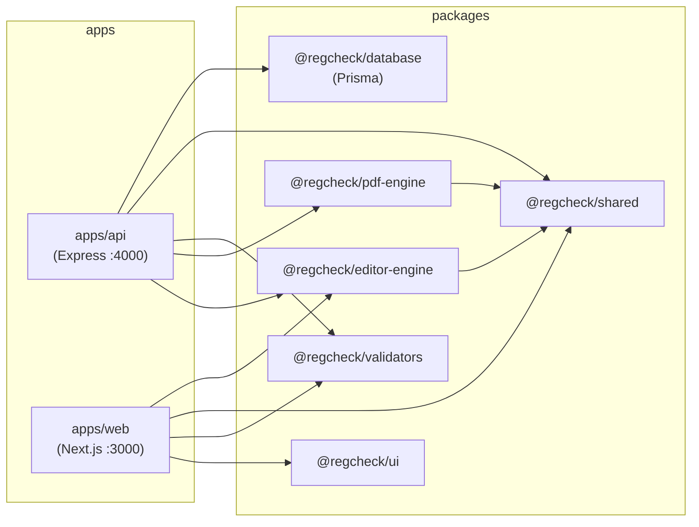
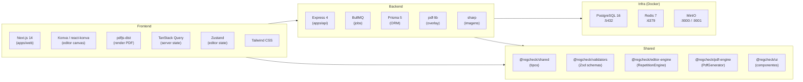

# RegCheck

> Construtor e preenchedor de templates de documentos PDF — monorepo Turborepo + pnpm.

O RegCheck permite criar templates visuais sobre PDFs existentes, posicionando campos interativos via drag-and-drop, e depois preencher esses campos para gerar novos PDFs automaticamente. Suporta repetição de campos em grade (ex.: etiquetas de equipamentos) e geração assíncrona via fila BullMQ.

---

## Arquitetura do Monorepo



## Stack Tecnológica por Camada



---

## URLs de Acesso Local

| Serviço          | URL                          | Descrição                        |
|------------------|------------------------------|----------------------------------|
| Frontend         | http://localhost:3000        | Interface Next.js                |
| API              | http://localhost:4000        | API Express                      |
| MinIO Console    | http://localhost:9001        | Painel de administração do MinIO |
| Prisma Studio    | http://localhost:5555        | Visualizador do banco de dados   |

---

## Setup

### Pré-requisitos

- Node.js >= 20
- pnpm 9.x (`npm install -g pnpm@9`)
- Docker Desktop (Windows/Mac) ou Docker + Docker Compose (Linux)

### Instalação Rápida

```bash
# 1. Clone o repositório
git clone <url-do-repo>
cd regcheck

# 2. Instale as dependências
pnpm install

# 3. Inicie tudo automaticamente (infra + migração + apps)
pnpm start:all
```

Pronto! A aplicação estará rodando em:
- Frontend: http://localhost:3000
- API: http://localhost:4000
- Prisma Studio: http://localhost:5555

### Instalação com Backup

Se você tem um backup para restaurar:

```bash
# Inicia tudo e restaura o backup automaticamente
pnpm start:restore
```

### Instalação Manual (passo a passo)

```bash
# 1. Clone o repositório
git clone <url-do-repo>
cd regcheck

# 2. Instale as dependências
pnpm install

# 3. Configure as variáveis de ambiente
cp .env.example .env
# Edite .env com suas configurações locais

# 4. Suba a infraestrutura (PostgreSQL, Redis, MinIO)
pnpm infra:up

# 5. Aplique o schema do banco de dados
pnpm db:push

# 6. Inicie o ambiente de desenvolvimento
pnpm dev
```

---

## Comandos Essenciais

### Desenvolvimento

| Comando              | Descrição                                                        |
|----------------------|------------------------------------------------------------------|
| `pnpm start:all`     | 🚀 Comando completo: para containers, sobe infra, migra DB, inicia API + Web + Prisma Studio |
| `pnpm start:restore` | 🔄 Igual ao `start:all` + restaura backup automático (banco + PDFs) |
| `pnpm dev`           | Inicia todos os apps em modo desenvolvimento (Turborepo)         |
| `pnpm dev:api`       | Inicia apenas a API (`apps/api`) com logs completos              |
| `pnpm dev:web`       | Inicia apenas o frontend (`apps/web`) com logs completos         |
| `pnpm dev:all`       | Inicia API + Web com logs em stream                              |
| `pnpm up`            | Atalho: `infra:up` + `wait:infra` + `dev:all`                    |
| `pnpm up:studio`     | Igual ao `up` + Prisma Studio                                    |

### Build e Qualidade

| Comando              | Descrição                                                        |
|----------------------|------------------------------------------------------------------|
| `pnpm build`         | Build de produção de todos os pacotes e apps                     |
| `pnpm lint`          | Executa lint em todos os pacotes e apps                          |
| `pnpm type-check`    | Verifica tipos TypeScript em todos os pacotes e apps             |
| `pnpm format`        | Formata todos os arquivos com Prettier                           |
| `pnpm clean`         | Remove artefatos de build de todos os pacotes                    |

### Infraestrutura Docker

| Comando              | Descrição                                                        |
|----------------------|------------------------------------------------------------------|
| `pnpm infra:up`      | Sobe os containers Docker (PostgreSQL, Redis, MinIO) em background |
| `pnpm infra:down`    | Para e remove os containers Docker                               |
| `pnpm infra:logs`    | Sobe os containers com logs no terminal                          |

### Banco de Dados

| Comando              | Descrição                                                        |
|----------------------|------------------------------------------------------------------|
| `pnpm db:push`       | Aplica o schema Prisma no banco sem criar migration              |
| `pnpm db:migrate`    | Cria e aplica uma migration Prisma                               |
| `pnpm db:generate`   | Gera o Prisma Client                                             |
| `pnpm db:studio`     | Abre o Prisma Studio na porta 5555                               |
| `pnpm db:export`     | Exporta banco + arquivos MinIO para backup.zip                   |
| `pnpm db:import`     | Importa backup.zip completo (banco + PDFs)                       |
| `pnpm db:restore`    | Restaura o backup mais recente (banco + PDFs)                    |
| `pnpm db:restore-pdfs` | Restaura apenas PDFs do backup (sem afetar banco)              |

### Dados de Teste

| Comando              | Descrição                                                        |
|----------------------|------------------------------------------------------------------|
| `pnpm seed:balanças` | Popula o banco com dados de exemplo de balanças                  |

---

## Backup e Restore

### Criar Backup

Para exportar o banco de dados e arquivos do MinIO:

```bash
pnpm db:export
```

Isso cria um arquivo `backups/backup-<timestamp>.zip` contendo:
- Dump completo do PostgreSQL
- Todos os PDFs do MinIO

### Restaurar Backup

**Opção 1 - Automático (recomendado para setup inicial):**

```bash
# Inicia tudo e restaura o backup automaticamente
pnpm start:restore
```

**Opção 2 - Manual (quando a aplicação já está rodando):**

```bash
# 1. Suba a infraestrutura e aplicação
pnpm start:all

# 2. Em outro terminal, restaure apenas os PDFs (sem derrubar o banco)
pnpm db:restore-pdfs
```

**Opção 3 - Restauração completa (banco + PDFs):**

```bash
# Restaura banco e PDFs (requer API rodando)
pnpm db:restore
# ou especifique um arquivo:
pnpm db:import backups/backup-2026-03-28T14-12-28.zip
```

**Importante:** 
- A restauração completa (`db:restore`) derruba e recria o schema do banco, o que pode desconectar a API temporariamente
- Para restaurar apenas PDFs sem afetar o banco, use `db:restore-pdfs`
- A restauração de PDFs requer que a API esteja rodando, pois os arquivos são enviados via upload para garantir indexação correta no MinIO

### Quando usar cada comando

| Comando | Quando usar |
|---------|-------------|
| `pnpm start:restore` | Setup inicial do projeto com backup |
| `pnpm db:restore-pdfs` | Restaurar apenas arquivos PDF (aplicação rodando) |
| `pnpm db:restore` | Restauração completa (banco + PDFs) |
| `pnpm db:export` | Criar novo backup |

---

## Documentação

- [Índice da documentação](docs/index.md)
- [Arquitetura do sistema](docs/architecture.md)
- [Fluxos principais](docs/flows.md)
- [Convenções de código](docs/conventions.md)
- [API dos pacotes compartilhados](docs/packages.md)
- [Guia de contribuição](docs/contributing.md)
- [Architecture Decision Records (ADRs)](docs/adr/README.md)

---

## Troubleshooting

> Rodando em Windows e Linux? Veja [docs/contributing.md — Desenvolvimento Cross-platform](docs/contributing.md#desenvolvimento-cross-platform).

### Porta já em uso

**Sintoma:** `Error: listen EADDRINUSE :::4000` ou `:::3000`

**Solução:**
```bash
# Encontre o processo usando a porta
lsof -i :4000
# Encerre o processo
kill -9 <PID>
```

No Windows (PowerShell):
```powershell
netstat -ano | findstr :4000
taskkill /PID <PID> /F
```

---

### MinIO não sobe

**Sintoma:** Container `minio` reinicia em loop ou `minio-init` falha com connection refused.

**Solução:**
```bash
# Verifique os logs do container
pnpm infra:logs

# Remova volumes antigos e recrie
pnpm infra:down
docker volume rm regcheck_minio_data
pnpm infra:up
```

---

### Prisma migration falha

**Sintoma:** `Error: P3009 migrate found failed migrations` ou `drift detected`.

**Solução:**
```bash
# Reseta o banco (apaga todos os dados) e reaaplica o schema
pnpm --filter @regcheck/database db:push -- --force-reset

# Ou, para ambientes de desenvolvimento com dados que podem ser perdidos:
pnpm db:migrate -- --name reset
```

---

### Erro de CORS na API

**Sintoma:** `Access to fetch at 'http://localhost:4000' from origin 'http://localhost:3000' has been blocked by CORS policy`

**Solução:** Verifique se a variável `CORS_ORIGIN` no `.env` está configurada corretamente:

```env
CORS_ORIGIN=http://localhost:3000
```

Reinicie a API após alterar o `.env`:
```bash
pnpm dev:api
```
