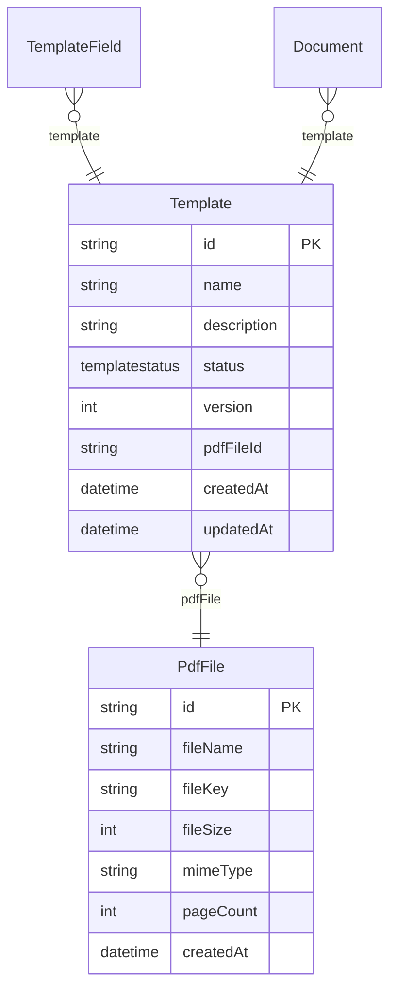

# Task 3.2: ERD Generator - Implementation Summary

## Overview

Successfully implemented the ERD (Entity Relationship Diagram) generator that creates Mermaid diagram syntax from parsed Prisma schemas.

## Files Created

### 1. `scripts/docs/erd-generator.ts`

Main ERD generator module with the following functions:

- **`generateERD(schema: PrismaSchema): string`**
  - Generates complete Mermaid ERD syntax from a parsed schema
  - Includes relationships with cardinality notation
  - Includes entity definitions with fields and types
  - Marks primary keys with "PK" suffix

- **`generateERDCodeBlock(schema: PrismaSchema): string`**
  - Wraps ERD in markdown code block for direct embedding in documentation

- **`generatePartialERD(schema: PrismaSchema, modelNames: string[]): string`**
  - Generates ERD for a subset of models
  - Useful for focused diagrams

### 2. `scripts/docs/erd-generator.test.ts`

Comprehensive unit tests covering:

- Single and multiple entity generation
- All relationship types (one-to-many, many-to-one, one-to-one, many-to-many)
- Various Prisma field types (String, Int, Float, Boolean, DateTime, Json)
- Array fields
- Enum fields
- Relation field exclusion
- Empty schema handling
- Code block wrapping
- Partial ERD generation

### 3. `scripts/docs/verify-erd-generator.ts`

Verification script that:

- Reads the actual Prisma schema
- Generates ERD from real data
- Writes output to `erd-generator-output.md` for inspection

## Key Features

### Relationship Cardinality Mapping

- `one-to-many` → `||--o{`
- `many-to-one` → `}o--||`
- `one-to-one` → `||--||`
- `many-to-many` → `}o--o{`

### Field Type Mapping

- `String` → `string`
- `Int` → `int`
- `Float` → `float`
- `Boolean` → `boolean`
- `DateTime` → `datetime`
- `Json` → `json`
- Enum types → lowercase (e.g., `TemplateStatus` → `templatestatus`)

### Smart Field Filtering

- Excludes relation fields from entity definitions
- Only shows data fields (non-relation fields)
- Properly identifies reverse relation fields (e.g., `templates Template[]`)

## Test Results

✅ All 14 unit tests passed

- 11 tests for `generateERD()`
- 1 test for `generateERDCodeBlock()`
- 2 tests for `generatePartialERD()`

## Verification with Real Schema

Tested with the actual RegCheck Prisma schema:

- **10 models** successfully parsed
- **3 enums** identified
- **18 relationships** generated (both sides of each relation)
- All entities show only data fields
- Primary keys properly marked with "PK"

## Example Output



## Integration with Documentation System

The ERD generator is ready to be used by:

- Task 6.1: Data model document generator (`04-modelagem-dados.md`)
- Any other documentation that needs ERD visualization

## Requirements Satisfied

✅ Requirement 4.3: Generate Mermaid ERD syntax from entities
✅ Add relationship lines with cardinality
✅ Add entity definitions with fields and types
✅ Mark primary keys with "PK" suffix

## Bug Fix in Prisma Parser

During implementation, identified and fixed an issue in `prisma-parser.ts`:

- Reverse relation fields (e.g., `templates Template[]`) were not being properly identified as relations
- Added logic to detect array fields with no attributes as reverse relations
- This ensures they are excluded from entity definitions in the ERD

## Next Steps

Task 3.2 is complete. The ERD generator is fully functional and tested. It can now be used by:

- Task 6.1 to generate the data model documentation
- Any other documentation generation tasks that need ERD diagrams

## Usage Example

```typescript
import { parsePrismaSchema } from './prisma-parser';
import { generateERDCodeBlock } from './erd-generator';

const schemaContent = readFileSync('schema.prisma', 'utf-8');
const schema = parsePrismaSchema(schemaContent);
const erdMarkdown = generateERDCodeBlock(schema);

// Use erdMarkdown in documentation
```
