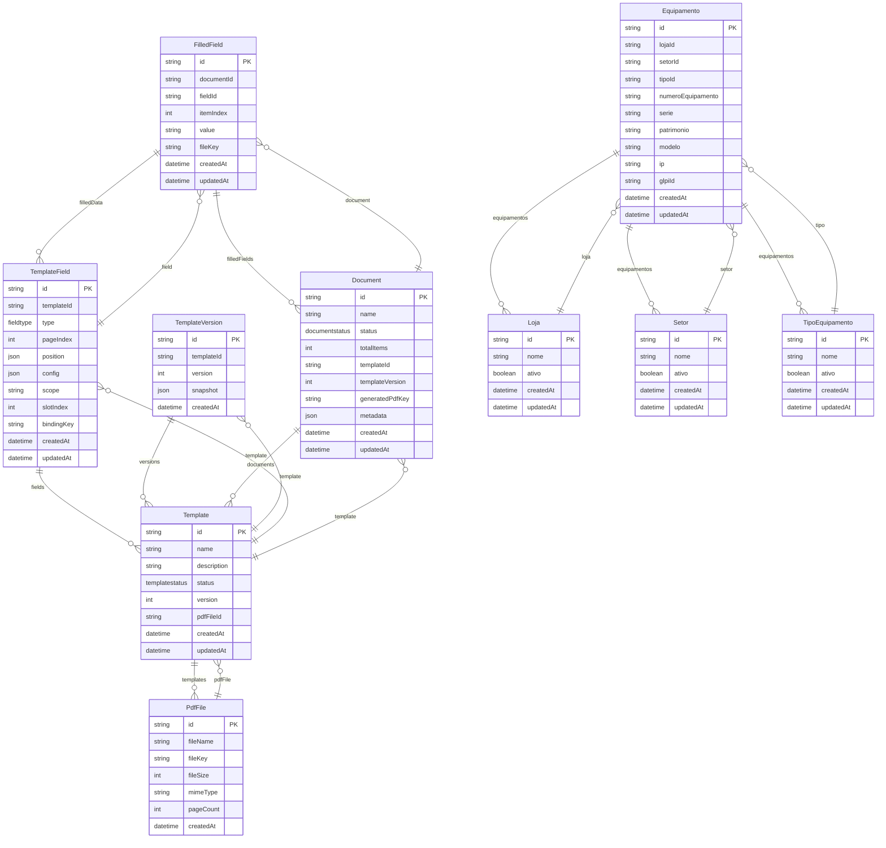

# ERD Generator Verification

## Summary

- Models: 10
- Enums: 3
- Relationships: 18

## Generated ERD



## Raw ERD Syntax

```
erDiagram
    Template ||--o{ PdfFile : "templates"
    Template }o--|| PdfFile : "pdfFile"
    TemplateField ||--o{ Template : "fields"
    TemplateVersion ||--o{ Template : "versions"
    Document ||--o{ Template : "documents"
    TemplateVersion }o--|| Template : "template"
    TemplateField }o--|| Template : "template"
    FilledField ||--o{ TemplateField : "filledData"
    Document }o--|| Template : "template"
    FilledField ||--o{ Document : "filledFields"
    FilledField }o--|| Document : "document"
    FilledField }o--|| TemplateField : "field"
    Equipamento ||--o{ Loja : "equipamentos"
    Equipamento ||--o{ Setor : "equipamentos"
    Equipamento ||--o{ TipoEquipamento : "equipamentos"
    Equipamento }o--|| Loja : "loja"
    Equipamento }o--|| Setor : "setor"
    Equipamento }o--|| TipoEquipamento : "tipo"
    PdfFile {
        string id PK
        string fileName
        string fileKey
        int fileSize
        string mimeType
        int pageCount
        datetime createdAt
    }
    Template {
        string id PK
        string name
        string description
        templatestatus status
        int version
        string pdfFileId
        datetime createdAt
        datetime updatedAt
    }
    TemplateVersion {
        string id PK
        string templateId
        int version
        json snapshot
        datetime createdAt
    }
    TemplateField {
        string id PK
        string templateId
        fieldtype type
        int pageIndex
        json position
        json config
        string scope
        int slotIndex
        string bindingKey
        datetime createdAt
        datetime updatedAt
    }
    Document {
        string id PK
        string name
        documentstatus status
        int totalItems
        string templateId
        int templateVersion
        string generatedPdfKey
        json metadata
        datetime createdAt
        datetime updatedAt
    }
    FilledField {
        string id PK
        string documentId
        string fieldId
        int itemIndex
        string value
        string fileKey
        datetime createdAt
        datetime updatedAt
    }
    Loja {
        string id PK
        string nome
        boolean ativo
        datetime createdAt
        datetime updatedAt
    }
    Setor {
        string id PK
        string nome
        boolean ativo
        datetime createdAt
        datetime updatedAt
    }
    TipoEquipamento {
        string id PK
        string nome
        boolean ativo
        datetime createdAt
        datetime updatedAt
    }
    Equipamento {
        string id PK
        string lojaId
        string setorId
        string tipoId
        string numeroEquipamento
        string serie
        string patrimonio
        string modelo
        string ip
        string glpiId
        datetime createdAt
        datetime updatedAt
    }

```

## Models Found

- PdfFile (8 fields)
- Template (12 fields)
- TemplateVersion (6 fields)
- TemplateField (13 fields)
- Document (12 fields)
- FilledField (10 fields)
- Loja (6 fields)
- Setor (6 fields)
- TipoEquipamento (6 fields)
- Equipamento (15 fields)

## Relationships Found

- Template one-to-many PdfFile
- Template many-to-one PdfFile
- TemplateField one-to-many Template
- TemplateVersion one-to-many Template
- Document one-to-many Template
- TemplateVersion many-to-one Template
- TemplateField many-to-one Template
- FilledField one-to-many TemplateField
- Document many-to-one Template
- FilledField one-to-many Document
- FilledField many-to-one Document
- FilledField many-to-one TemplateField
- Equipamento one-to-many Loja
- Equipamento one-to-many Setor
- Equipamento one-to-many TipoEquipamento
- Equipamento many-to-one Loja
- Equipamento many-to-one Setor
- Equipamento many-to-one TipoEquipamento

✓ ERD generation completed successfully!
