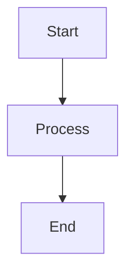
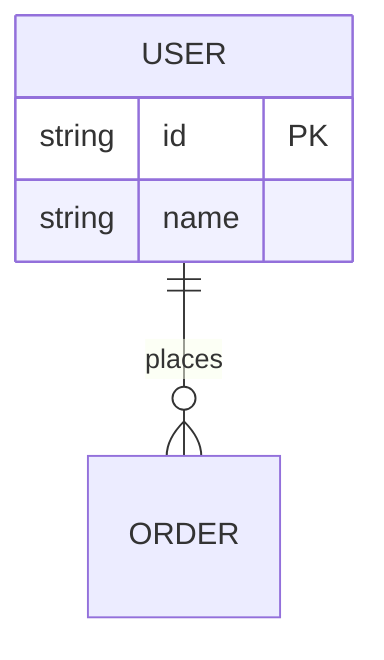
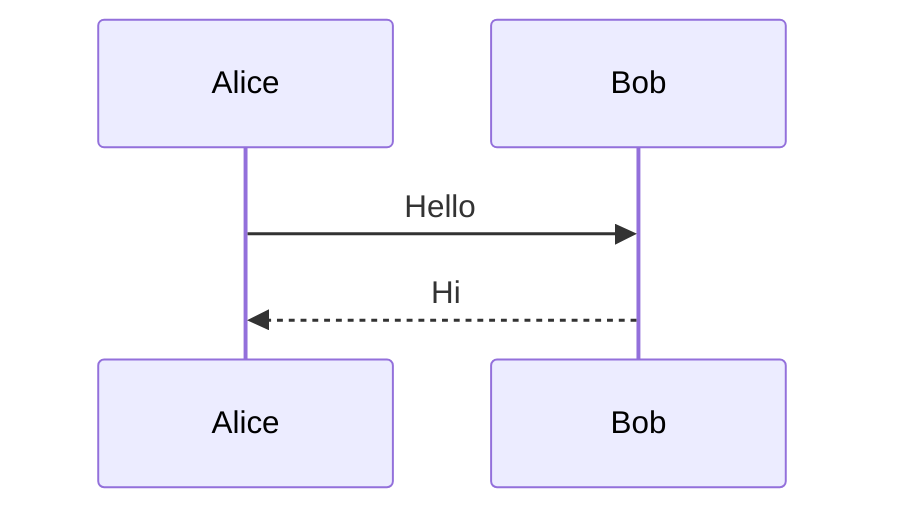

# Markdown Formatter Example Output

This file demonstrates the output of all markdown formatter functions.

## Heading Examples

# Level 1 Heading

## Level 2 Heading

### Level 3 Heading

## Code Block Example

```typescript
const x = 1;
const y = 2;
console.log(x + y);
```

## Table Example

| Name | Type | Required |
|---|---|---|
| id | string | yes |
| name | string | yes |
| age | number | no |

## List Examples

### Unordered List

- First item
- Second item
- Third item

### Ordered List

1. Step 1
2. Step 2
3. Step 3

## Link Examples

[Documentation](./docs/README.md)
[GitHub](https://github.com)

## Mermaid Diagram Examples

### Graph Diagram



### ERD Diagram



### Sequence Diagram


